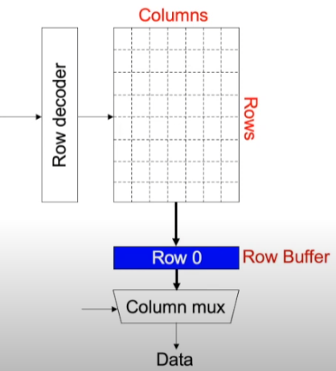
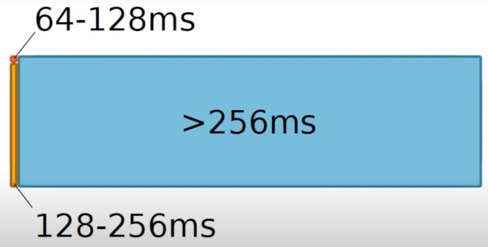
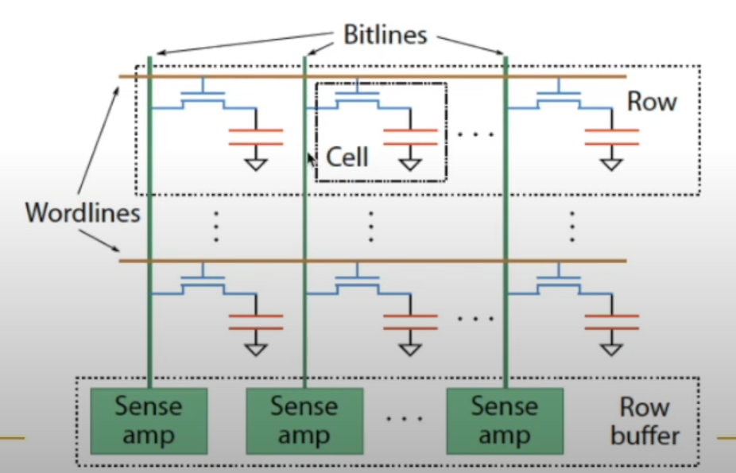

# Computer Organization and Architecture

    ---*form ETH Zurich  苏黎世联邦理工*

*Two goals of this course:  Enable you to think critically and broadly*

## Lecture 1: Introduction

### Four key direction

1. Fundamentally Secure/Reliable/Safe Architectures    安全，可靠，保险的基本结构
2. Fundamentally Energy-Efficient Architectures      高效的基本结构
3. Fundamentally Low-Latency and Predictable Architectures    底层，可预见的基本结构
4. Architecture for AI/ML, Genomics, Medicine, Health      AI/机器学习，基因，药学，健康

### How Computers Work

#### The transformation hierarchy    转换层次

**problem --> Algorithm --> Program/Language --> Runtime system 运行时系统(VM,OS,MM) --> ISA(SW/HW Interface) --> Micro-architecture微架构 --> Logic逻辑门 --> Devices设备 --> Electrons电子元件**

- narrow view 狭义: Computer architecture contains  **SW/HW interface** and **Micro-architecture**.
- Expanded view 广义:  From **Algorithm to devices**.

#### ISA

Instruction Set Architecture

### Algorithm

A Step-by-step procedure that is guaranteed to terminate where each step is precisely stated and can be carried out by a computer.

一个由计算机执行，保证每一个步骤都能被清晰地说明的程序。

Three characteristics

- Finiteness   有限性
- Definiteness   确定性
- Effective computability    有效计算性

## Lecture 2a: Memory Performance Attacks

*——内存执行冲突*

Many Cores on chip, it's a trend.

### Efficiency issues

Why is there any slowdown? 放缓

Why is there a disparity in slowdowns? 放缓不同步

How can we solve the problem if we do not want that disparity?

Why is slowdown important?

1. We want to execute applications in parallel in multi-core systems  -> consolidate more and more (for efficiency)

- Cloud computing
- Mobile phones
- Automotive systems 汽车系统

2. We want to mix different types or applications together

- those requiring QoS(Quality of service) guarantee(e.g., video, pedestrian detection步行记录)
- those that are important but less so
- those that are less important

3. We want the system to be controllable and high-performance.可控且高效

- Why the Disparity in slowdowns?

DRAM Memory Controller is **unfair**.

DRAM 处理请求时，会通过DRAM 存储控制器**不公平**地处理请求，运行速度快的进程DRAM加载速度快，运行速度慢的进程DRAM加载速度慢。

### DRAM Bank Operation

DRAM 库操作

This view of a bank is an abstraction.  (The bank means 存储库.)

Internally, a bank consists of many cells (transistors 晶体管 && capacitors 电容器) and other structures that enable access to cells.

When you put a request on DRAM, this request will be saved as a coordinate(坐标) like  (column, row).  Here, the request will be decoded with Row Decoder, then the row will be activated and put into the Row Buffer.  Finally, the request will go through the column mux(列复用选择器), and the data will be loaded.

At the same time, if we want to load the second data request, and the row number is the same as the row number of the first request, the request will skip the row buffer and be sent directly to the column multiplexer. **The reason is that row has been activated.**

 **row buffer 有 预装载， 激活， 列访问 三种功能。** 如何缓冲区没有任何内容，则缓冲区只需要一个列访问，三种功能都有不同的延迟。

**DRAM Controllers**

- A row-conflict memory access takes significantly longer than a row-hit access. 内存冲突访问比行命中访问花费的时间长的多。
- Current controllers take advantage of this fact
- Commonly used scheduling policy (*FR-FCFS*)[Rixner 2000]*

  - Row-hit first: Service row-hit memory accesses first
  - Oldest-first: The service older accesses first
- The scheduling policy aims to maximize DRAM throughput.(吞吐量)

  增大吞吐量实际上时把buffer变小，因为在使用

*Scott Rixner et al., "Memory Access Scheduling," ISCA 2000.*

**The Problem**

- Multiple applications share the DRAM controller
- DRAM controllers designed to maximize DRAM data throughput
- DRAM scheduling policies are unfair to some applications    DRAM 调度策略对某些应用程序不公平

  - Row-hit first: unfairly prioritizes apps with high row buffer locality

    不公平地优先考虑具有高行缓冲区位置的应用程序

    - Threads that keep on accessing the same rowd

      继续访问同一行的线程
  - Oldest-first: unfairly prioritizes memory-intensive applications

    不公平地优先考虑内存密集型应用程序
- DRAM controller vulnerable to denial of service attacks

  Can write programs to exploit unfairness

In order to solve the problem, we can find different aspect. Require the programmer to solve DRAM unfairness problem is definitely impossible, this substratum porblem would be solved in hardware level like memory controller, DRAM, circuits etc.

## Lecture 2b: Data retention and Memory Refresh

*——数据存储与内存刷新*

### DRAM Refresh

- DRAM capacitor charge leaks over time. DRAM 电容器随时间泄露
- The memory controller needs  to refresh each row periodically to restore charge. 内存控制器需要定期刷新每一行以恢复电荷
    - Activate each row every N ms
    - Typical N = 64 ms
- Downsides of refresh
    - **Energy consumption**: Each refresh consumes energy 
    - **Performance degradation(性能下降)**: DRAM rank/bank unavailable while refreshed
    - **QoS/predictability impact**:(Long)pause times during refresh
    - **Refresh rate limits DRAM capacity scaling**刷新率限制 DRAM 容量扩展

**如果DRAM不断扩大，刷新所用时间与能量将大幅增加，而DRAM刷新时无法被访问，那么因此DRAM利用率将大幅下降。**

*Liu et al., "RAIDR: Retention-Aware Intelligent DRAM Refresh," ISCA 2012*

------

**How to solve the problem?**

- Do we need to refresh all rows every 64 ms?    Absolutely no. manufacturing is not perfect. Not all DRAM cells are exactly the same. Some are more leaky than others.

- We have such a **Profile**, we can taking advantage of this profile. 

**Retention Time Profile of DRAM**

**Data Pattern Dependence**

- Electrical noise on the bitline affects reliable sensing of a DRAM cell. 比特线上的电噪声会影响DRAM单元的可靠检测
- The magnitude of this noise is affected by values of nearly cells via. 这种噪音的大小受邻近的单元值的影响
    - Bitline-bitline coupling -> electrical coupling between adjacent bitlines 相邻位线之间的电耦合
    - Bitline-wordline coupling ->  electrical coupling between each bitline and the activated wordline. 每个位线和激活的字线之间的电耦合

**Retention time of a cell depends on data patterns stored in nearby cells.** 一个单元附近的单元状态（模式）决定了这个单元的数据保存时间

**Need to find the worst data pattern to find worst-case retention time.** 需要找到一种最坏的数据模式以找到最坏的储存时间

**Data patterns Dependence (DPD): Implications on profile mechanisms** 对配置文件机制的影响

- Any retention time profiling mechanism must handle data pattern dependence of retention time. 任何存储时间分析机制都必须处理数据模式对存储时间的依赖性
- *Intuitive approach*直观方式: Identify the data pattern that induces the worst-case retention time for a particular cell or device.
- *problem1: very hard to know at the memeory controller which bits actually interfere with each other due to:*
    - Opaque mapping of addresses to physical DRAM geometry -> **logically consecutive bits may not be physically consecutive**
    - Remapping of faulty bitlines/wordlines to redundant(冗余) ones internally within DRAM. 将故障位线/字线重新映射到 DRAM 内部的冗余位线
- *problem2: Worst-case coupling noise is affected by non-obvious second order bitline coupling effects.*

​								最坏情况下的耦合噪声受不明显的二阶位线耦合效应的影响

------

**Two Challenges to Retention Time Profiling**

- *Challenge2:* Variable Retention Time(VRT)	可变存储时间

    - Retention time of a DRAM cell changes randomly over time. 

        ​											DRAM单元的保留时间随时间随机变化

        - a cell alternates between multiple retention time states. 

            ​							 一个单元在多个保留时间状态之间交替

    - Leakage current of  a cell changes sporadically due to charge trap in the gate oxide of the DRAM cell access transistor. 

        由于 DRAM 单元存取晶体管的栅极氧化物中的电荷陷阱，单元的泄漏电流会偶尔发生变化。

    - When the trap becomes occupied, charge leaks more readily from the transistor's drain, leading to a short retention time.

        当陷阱被占据时，电荷更容易从晶体管的漏极泄漏，导致保留时间缩短。

        - Called *Trap-Assisted Gate-Induced Drain Leakage* 陷阱辅助栅极引起的漏极泄漏

    - This process appears to be a random process. 这个过程似乎是一个随机过程

    - **Worst-case retention time depends on a random process ** 最坏情况下的保留时间取决于随机过程

        ->Need to find the worst case despite this
