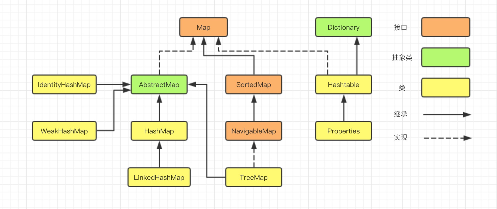
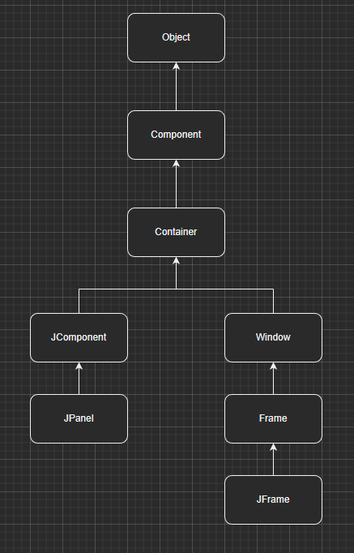

# Java API Advance

## I. Basic `API`

### 1. `Scanner`

### 2. `Number`

### 3. `Math`

`DecimalFormat` class

`DecimalFormat` class uses to output the number according to the regular format.

eg: output fixed length of eight

```java
DecimalFormat df = new DecimalFormat("00000000");
```

### 4. `System`

## II. Unit Test  and main function

1. 关于 Main function

   Java 中，main 方法 应是 一个项目的入口点，而不是用于测试新模块。

   main 方法应具备**“逻辑控制语句少，且只做项目的程序入口点”** 的特点。
2. 在项目中需要使用的“功能性控制语句”，必须将其从main 方法中剥离出来单独建立一个方法，以提高程序的复用性。
3. 单元测试：主方法测试主要步骤为：

   1） 本地测试；

   2） 调用方法；

   3） 检查输出，用肉眼可见的方式（打印结果）进行检查，查看是否符合预期；

   4） **预期结果和测试结果是通过人工计算的。**

   在项目开发当中，一般不使用在main function 当中进行测试，
4. What's the JUnit?

   **JUnit 5 = JUnit Platform + JUnit Jupiter + JUnit Vintage**

   Official  explanation：

   The **JUnit Platform** serves as a foundation for [launching testing frameworks](https://junit.org/junit5/docs/current/user-guide/#launcher-api) on the JVM.

   “	JUnit  5  平台服务是在 `JVM`上启动测试框架的基础。”

   JUnit 5 通过注释来实现单元测试。

   **`@Test`**

**注意：正式应用当中，Test 通常单独列出一个文件夹用于存放Unit  Test.**

5. 断言：

   用以测试单元的结果值与期望值是否相等。

   `assertEpuals()`方法；

   ```java
   import org.junit.Assert;
   import org.junit.Test;
   
   /**
    * Test Framework ,测试框架，Unit test ,单元测试。
    */
   public class CalculatorTest {
   
       @Test
       public void sum() {
           int sum = Calculator.sum(3, 4);
           // Assert  断言
           Assert.assertEquals(4,sum);
       }
   }
   ```

## III. String Builder

    注意：String类概念中明确指出，String 在被定义之后，其值是无法改变的，如果程序中出现了大量的String变量，运行时则会存在占用大量内存的情况，若不及时进行垃圾回收则会出现程序运行速度慢和内存不足的情形，而Java为了解决此问题，从而出现了`StringBuilder()`方法。

## IV. Exception   异常

### 介绍

**异常是程序中的一些错误，但并不是所有的错误都是异常，并且错误有时候是可以避免的。**

比如说，你的代码少了一个分号，那么运行出来结果是提示是错误` java.lang.Error`；如果你用`System.out.println(11/0)`，那么你是因为你用0做了除数，会抛出` java.lang.ArithmeticException `的异常。

异常发生的原因有很多，通常包含以下几大类：

- 用户输入了非法数据。
- 要打开的文件不存在。
- 网络通信时连接中断，或者JVM内存溢出。

这些异常有的是因为用户错误引起，有的是程序错误引起的，还有其它一些是因为物理错误引起的。

### 异常类结构

    异常类： Thorwable 类. Error类. Exception 类。Error 与Exception 都继承自Thorwable.所有异常和错误实例都属于Thorwable子类。

Error 指非常严重的错误，通常无法通过修改代码来排除错误；Exception 一般指用户造成的错误，语法正确但存在异常。

### 异常分类

异常类通常来讲分为两种，一种是**受检异常**，另一种是**未受检异常**。

　　**受检异常是Java内部定义的一系列异常类**，它们都实现了Exception接口，这些异常**必须被手动捕捉或者手动抛出**，否则无法通过编译，处于强制处理异常，属于***编译期异常***。

　　未受检异常则是一些可以不进行捕捉的异常，这些异常一般是由运行时逻辑引发，这些异常可以不捕捉，也可以进行捕捉或抛出，如果未进行捕捉、抛出处理，那么一旦运行时引发了这些异常，那么会被JVM直接处理，它包括运行时异常和Error。

1. **Runtime Exception     运行时异常**

   编译通过但运行时出现异常。
2. 非运行时异常。

### 抛出异常

    异常的抛出需要使用throw关键字，抛出的是一个异常对象，一般我们采用下面的方式进行抛出

```java
throw new NullPointerException();
```

```java
	@Test
    public void demoThrow() throws NullPointerException, PackagerException {
        try {
            int[] arr_1 = {12, 34, 56, 78, 19};
            System.out.println(arr_1[30]);
        } catch (Exception e) {
            // try/catch 套用 抛出空指针异常
            throw new NullPointerException();
        }
    }
```

### 自定义异常

自定义异常一般可以使用枚举类来实现。

### 好的异常使用习惯

- 1. 在写程序时，对可能会出现异常的部分通常要用try{...}catch{...}去捕捉它并对它进行处理；
  2. 用try{...}catch{...}捕捉了异常之后一定要对在catch{...}中对其进行处理，那怕是最简单的一句输出语句，或栈输入e.printStackTrace();
  3. 如果是捕捉IO输入输出流中的异常，一定要在try{...}catch{...}后加finally{...}把输入输出流关闭；
  4. 如果在方法体内用throw抛出了某种异常，最好要在方法名中加throws抛异常声明，然后交给调用它的上层方法进行处理。

## V. File stream 文件流

## VI. I/O stream  输入/输出流

- 注意： `FileInputStream, FileOutputStream, BufferedInputStream, BufferedOutputStream`可以以**byte**类型操作任何文件；

  注意： `FileReader`（需要强制转换成char类型输出）, `FileWriter, BufferedReader, BufferedWriter`以**char**的形式对txt文件进行读取和写入。


**将数据从外存中读取到内存中的称为输入流，将数据从内存写入外存中的称为输出流。**


1. **文件输入流：`FileInputStream`**：按照byte的形式，将外存中的数据读取进内存中，且在monitor上显示文件的每一个字符。（**`OutputStream`** is an output stream for writing data/streams of raw bytes to file or storing data to file.）(此方法为原理，并非实际应用中所使用的方法)

   ```java
   public void inputFile() throws IOException {
   
           FileInputStream fileInputStream = new FileInputStream("file/readFile.txt");
           int by = 0;
           while ((by = fileInputStream.read()) != -1) {
               //fileInputStream默认以比特读取文件，故用强制转换成字节读取
               System.out.print((char) by);
           }
           // 使用读取流后使用close()方法关闭该流
           fileInputStream.close();
       }
   ```
2. **文件输出流：`FileOutputStream`**:按照byte的形式，将内存中的数据写入外存中。（**`FileInputStream class`** is useful to read data from a file in the form of a sequence of bytes.）(此方法为原理，并非实际应用中所使用的方法)`

```java
public void outputFile() throws IOException {
        FileOutputStream fileOutputStream = new FileOutputStream("file/writedFile.txt");
        byte[] bytes = "Max_Croft".getBytes();
        for (int x = 0; x < bytes.length; x++) {
            //FileOutputStream默认以比特写入文件，故用强制转换使其以字节输出
            System.out.print((char) bytes[x]);
        }
        fileOutputStream.close();
    }
```

### 拷贝文件信息（先读取再写入）

(此方法为原理，并非实际应用中所使用的方法)

```java
public void copyFileBase() throws IOException {
        FileInputStream fileInputStream = new FileInputStream("file/1.jpg");
        FileOutputStream fileOutputStream = new FileOutputStream("file/12.jpg");

        //create an array to open a buffer area
        byte[] buffer = new byte[1024];
        int lo;
        while ((lo = fileInputStream.read(buffer)) != -1) {
            fileOutputStream.write(buffer, 0, lo);
        }
        fileInputStream.close();
        fileOutputStream.close();
    }
```

- JDK9原有方法：

1. **`BufferedInputStream`：**

```java
public void bufferFileInputBase() throws IOException {
        //缓冲输出方法   （bufferedFileStream 接收一个FileInputStream的对象）（装饰模式）
        BufferedInputStream bufferedInputStream = new BufferedInputStream(new FileInputStream("file/bufferFileBase.txt"));
        int by;
        while ((by = bufferedInputStream.read()) != -1) {
            System.out.print((char) by);
        }
        bufferedInputStream.close();
    }
```

2. **`BufferedOutputStream`**:

```java
//使用bufferedFileOutputStream()复制文件
    @Test
    public void bufferedFileOutputBase() throws IOException {
        BufferedInputStream bufferedInputStream = new BufferedInputStream(new FileInputStream("file/bufferedFileOutputBaseCopiedFile.txt"));
        BufferedOutputStream bufferedOutputStream = new BufferedOutputStream(new FileOutputStream("file/bufferedFileOutputBaseCopyFile.txt"));
        int by;
        while ((by = bufferedInputStream.read()) != -1) {
            bufferedOutputStream.write(by);
        }
        bufferedInputStream.close();
        bufferedOutputStream.close();
    }
```

3. **修饰模式，是一种动态地往一个类别中添加新的行为的。就功能而言，修饰模式相比生成更为灵活，这样可以给某个对象而不是整个类别添加一些功能。**

- *通过使用修饰模式，可以在运行时扩充一个类别的功能。原理是：增加一个修饰类包裹原来的类别，包裹的方式是在修饰类的构造函数中将原来的类以参数的形式传入。装饰类实现新的功能，但是，在不需要用到新功能的地方，它可以直接调用原来的类别中的方法。修饰类必须和原来的类别有相同的接口。*
- **修饰模式是类别继承的另外一种选择。类继承在编译时候增加行为，而装饰模式是在运行时增加行为。**

3. **`FileReader`:**

```java
 //字符流  用于读取和谐写入文本文件
    @Test
    public void fileReaderTest() throws IOException {
        FileReader fileReader = new FileReader("file/1.txt");

        int ch;
        while ((ch = fileReader.read()) != -1) {
            System.out.println((char) ch);
        }
        fileReader.close();
    }
```

4. **`FileWriter`:**

```java
@Test
    //字节流 用于读取和写入文本文件
    public void fileWriterTest() throws IOException {
        FileWriter fileWriter = new FileWriter("file/3.txt");
        fileWriter.write("This is a fileWriterTest.\n");
        fileWriter.close();
    }
```

5. **`BufferedReader`  :**

```java
@Test
    // 字节流 BufferedReader用于读取文本文件
    public void bufferedReaderTest() throws IOException {
        BufferedReader bufferedReader = new BufferedReader(new FileReader("file/1.txt"));
        String str;
        // read()读取单个字节  readLine() 读取一行
        while ((str =bufferedReader.readLine()) != null) {
            System.out.println(str);
        }
        bufferedReader.close();
    }
```

6. **`BufferedWriter`:**

```java
 @Test
    public void bufferedWriteTest() throws IOException {
        BufferedWriter bufferedWriter = new BufferedWriter(new FileWriter("file/4.txt"));
        bufferedWriter.write("This is a bufferedWriterTest file.");
        bufferedWriter.newLine();
        bufferedWriter.write("The second Line.");
        bufferedWriter.close();

    }	
```

---

## VII. 字符集

**ASCII**

GBK   国标字符集      字符编码转换      国际标准    Unicode  UTF - 8

---

## VIII. Multithreading

**名词解释：**

1. **进程：** 用户下达执进程式的命令后，就会产生进程。同一程序可产生多个进程（一对多关系），以允许同时有多位用户执行同一程序，却不会相冲突。进程需要一些资源才能完成工作，如[CPU](https://zh.wikipedia.org/wiki/CPU)使用时间、[存储器](https://zh.wikipedia.org/wiki/記憶體)、文件以及[I/O](https://zh.wikipedia.org/wiki/I/O)设备，且为依序逐一进行，也就是每个CPU核心任何时间内仅能执行一项进程。进程与线程的区别：进程是计算机管理运进程序的一种方式，一个进程下可包含一个或者多个线程。线程可以理解为子进程。
2. **线程： **是[操作系统](https://zh.wikipedia.org/wiki/操作系统)能够进行运算[调度](https://zh.wikipedia.org/wiki/调度)的最小单位。大部分情况下，它被包含在[进程](https://zh.wikipedia.org/wiki/进程)之中，是[进程](https://zh.wikipedia.org/wiki/进程)中的实际运作单位。一条线程指的是[进程](https://zh.wikipedia.org/wiki/进程)中一个单一顺序的控制流，一个进程中可以并发多个线程，每条线程并行执行不同的任务。线程是独立调度和分派的基本单位。
3. **进程与线程的区别**：进程是计算机管理运进程序的一种方式，一个进程下可包含一个或者多个线程。线程可以理解为子进程。
4. **并发：** 一个cpu在执行一个程序时中断并开始执行另一个程序，称为支持并发。
5. **并行:** 一个cpu可以同时用不同的进程执行不同的程序称为支持并行。

### 多线程的意义

一个进程中多个线程对此进程中的共享变量进行操作。

### Java 多线程的基本实现demo

**主线程**

```java
	public class Main {
    public static void main(String[] args){
        SecondThread secondThread = new SecondThread();
        // start() 方法开启一个新的线程
        secondThread.start();
		// 死循环表示此线程一直在工作
        while(true){
            System.out.println("The main thread");
        }
    }
}

```

 **次线程**

```java
public class SecondThread  extends Thread{
    // 重写Thread中的run方法
    // Thread中的run方法没有形参，重写时也不能带形参
    @Override
    public void run(){
        while(true){
            System.out.println("The Second thread ");
        }
    }
}
```

- *提出问题： Java 仅支持类继承一个类，不能继承多个类，故在此提出一个常用的解决方案： 用一个类实现多个接口即可。*

*example:*

- 方式一：

**主线程**

```java
public class Main {
    public static void main(String[] args){
        SecondThread secondThread = new SecondThread();
        // 创建一个thread对象，将需要使用的线程传入thread。
        Thread thread = new Thread(secondThread);
        thread.start();
        while(true){
            System.out.println("The main thread");
        }
    }
}

```

**次线程**

```java
public class SecondThread implements Runnable {
    // 重写Thread中的run方法
    @Override
    public void run() {
        while (true) {
            System.out.println("The Second thread ");
        }
    }
}
```

- 方式二：

**主线程**

```java
public class Main {
    public static void main(String[] args){
        SecondThread secondThread = new SecondThread();
        // 创建一个thread对象，将需要使用的线程传入thread。
        new Thread(secondThread,"ST").start();
        while(true){
            System.out.println("The main thread");
        }
    }
}
```

**次线程**

```java
public class SecondThread implements Runnable {
    // 重写Thread中的run方法
    @Override
    public void run() {
        while (true) {
            // currentThread()方法指向最近使用的线程
            System.out.println("The Second thread " + Thread.currentThread().getName());
        }
    }
}
```

理解多线程的一个示例

**main**

```java
public class Main {
    public static void main(String[] args){
        Shoes shoes = new Shoes();
        // The first thread 
        new Thread(shoes,"Max ").start();
        // The second thread
        new Thread(shoes,"Eryk ").start();
        // The third thread
        new Thread(shoes,"lily ").start();
    }

```

```java

public class Shoes implements Runnable {
    private int shoes = 100;

    @Override
    public void run() {
        while (true) {
            if (shoes > 0) {
                System.out.println(Thread.currentThread().getName() +"gets " +(shoes--)+ " pairs of shoes.");
            }
        }
    }
}
```

### Two thread types in Java

#### Daemon Threads 守护线程

*Daemon thread in Java is a low-priority thread that runs in the background to perform tasks such as garbage collection. Daemon thread in Java is also a service provider thread that provides services to the user thread. Its life depends on the mercy of user threads i.e. when all the user threads die, JVM terminates this thread automatically.*

*In simple words, we can say that it provides services to user threads for background supporting tasks. It has no role in life other than to serve user threads.*

守护线程（即daemon thread），是个服务线程，准确地来说就是服务其他的线程，这是它的作用——而其他的线程只有一种，那就是用户线程。

**守护线程，比如垃圾回收线程，就是最典型的守护线程。**

1、守护线程，专门用于服务其他的线程，如果其他的线程（即用户自定义线程）都执行完毕，连main线程也执行完毕，那么jvm就会退出（即停止运行）——此时，连jvm都停止运行了，守护线程当然也就停止执行了。

2、再换一种说法，如果有用户自定义线程存在的话，jvm就不会退出——此时，守护线程也不能退出，也就是它还要运行，干嘛呢，就是为了执行垃圾回收的任务啊。

3、守护线程又被称为“服务进程”“精灵线程”“后台线程”，是指在程序运行是在后台提供一种通用的线程，这种线程并不属于程序不可或缺的部分。 通俗点讲，任何一个守护线程都是整个JVM中所有非守护线程的“保姆”。

**用户线程，就是应用程序里的自定义线程。**

用户自定义线程

1、应用程序里的线程，一般都是用户自定义线程。

2、用户也可以在应用程序代码自定义守护线程，只需要调用Thread类的设置方法设置一下即可。

3、用户线程和守护线程几乎一样，唯一的不同之处就在于如果用户线程已经全部退出运行，只剩下守护线程存在了，JVM也就退出了。 因为当所有非守护线程结束时，没有了被守护者，守护线程也就没有工作可做了，也就没有继续运行程序的必要了，程序也就终止了，同时会“杀死”所有守护线程。 也就是说，只要有任何非守护线程还在运行，程序就不会终止。

在Java语言中，守护线程一般具有较低的优先级，它并非只由JVM内部提供，用户在编写程序时也可以自己设置守护线程，例如将一个用户线程设置为守护线程的方法就是在调用start()方法启动线程之前调用对象的setDaemon(true)方法，若将以上括号里的参数设置为false，则表示的是用户进程模式。

需要注意的是，**当在一个守护线程中产生了其它线程，那么这些新产生的线程默认还是守护线程**，用户线程也是如此。

**总结：通过`Thread.setDaemon(false)`设置为用户线程，通过`Thread.setDaemon(true)`设置为守护线程。**


**一个演示：**

**匿名内部类创建线程**

```java
public class Main {
    public static void main(String[] args) {
        new Thread(new Runnable() {
            @Override
            public void run() {
                while (true) {
                    System.out.println(Thread.currentThread().getName());
                }
            }
        }).start();

        while (true) {
            System.out.println("Main");
        }
    }
}
```

### Multithreading synchronized

**多线程同步问题和两种解决方案**   **synchronized   Lock**

线程非安全不同步问题

卖鞋案例

```
public class Main {
    public static void main(String[] args) {
        Shoes shoes = new Shoes();
        new Thread(shoes,"The first Customer ").start();
        new Thread(shoes,"The second Customer ").start();
        new Thread(shoes,"The third Customer ").start();
    }
}
```

```java
public class Shoes implements Runnable {
    private int shoes = 100;
    // 锁对象
    Object lock = new Object();

    @Override
    public void run() {
        synchronized (lock) {
            while (true) {
                if (shoes > 0) {
                    try {
                        Thread.sleep(500);
                    } catch (InterruptedException e) {
                        e.printStackTrace();
                    }
                    System.out.println(Thread.currentThread().getName() + "gets the " + (shoes--) + " pair of shoes.");
                }
            }
        }
    }
}

```

**同步代码块**

```java
public class Main {
    public static void main(String[] args) {
        Shoes shoes = new Shoes();
        new Thread(shoes,"The first Customer ").start();
        new Thread(shoes,"The second Customer ").start();
        new Thread(shoes,"The third Customer ").start();
    }
}
```

```java
public class Shoes implements Runnable {
    private int shoes = 100;
    // 锁对象
    Object lock = new Object();

    @Override
    public void run() {
        shoesCatch();
    }
    // 同步方法
    public synchronized void shoesCatch() {
        // 同步代码块
        while (true) {
            if (shoes > 0) {
                // 线程不同步也不安全
                try {
                    Thread.sleep(500);
                } catch (InterruptedException e) {
                    e.printStackTrace();
                }
                System.out.println(Thread.currentThread().getName() + "gets the " + (shoes--) + " pair of shoes.");
            }
        }
    }
}

```

**关于Lock API 的使用 **

```java
public class Main {
    public static void main(String[] args) {
        Shoes shoes = new Shoes();
        new Thread(shoes,"The first Customer ").start();
        new Thread(shoes,"The second Customer ").start();
        new Thread(shoes,"The third Customer ").start();
    }
}

```

```java
import java.util.concurrent.locks.*;

public class Shoes implements Runnable {
    private int shoes = 100;
    Lock reentrantLock = new ReentrantLock();

    @Override
    public void run() {
        while (true) {
            reentrantLock.lock();
            if (shoes > 0) {
                // 线程不同步也不安全
                try {
                    // 线程休眠
                    Thread.sleep(500);
                } catch (InterruptedException e) {
                    e.printStackTrace();
                }
                System.out.println(Thread.currentThread().getName() + "gets the " + (shoes--) + " pair of shoes.");
            }
            reentrantLock.unlock();
        }
    }

}

```

### Synchronized  和  Lock

| 类别     | **synchronized**                                                         | **Lock**                                                                                   |
| -------- | ------------------------------------------------------------------------------ | ------------------------------------------------------------------------------------------------ |
| 存在层次 | Java的关键字，在jvm层面上                                                      | 是一个类                                                                                         |
| 锁的释放 | 1、以获取锁的线程执行完同步代码，释放锁 2、线程执行发生异常，jvm会让线程释放锁 | 在finally中必须释放锁，不然容易造成线程死锁                                                      |
| 锁的获取 | 假设A线程获得锁，B线程等待。如果A线程阻塞，B线程会一直等待                     | 分情况而定，Lock有多个锁获取的方式，具体下面会说道，大致就是可以尝试获得锁，线程可以不用一直等待 |
| 锁状态   | 无法判断                                                                       | 可以判断                                                                                         |
| 锁类型   | 可重入 不可中断 非公平                                                         | 可重入 可判断 可公平（两者皆可）                                                                 |
| 锁性能   | 少量同步                                                                       | 大量同步                                                                                         |


- [说一说管程（Monitor）及其在Java synchronized机制中的体现](https://www.jianshu.com/p/e624460c645c)


### CPU 线程调度

操作系统对线程有不同的调度方法。

在默认情况下，每个线程的优先使用权是系统默认分配，是随机的。

系统允许人为对线程进行优先级的设定。

#### 线程状态

1. **初始状态(new)**

   实现Runnable接口和继承Thread可以得到一个线程类，new一个实例出来，线程就进入了初始状态。
   
2. **就绪状态(Runnable接口)(ready状态)**

- 就绪状态只是说你有资格运行，调度程序没有挑选到你，你就永远是就绪状态。
- 调用线程的start()方法，此线程进入就绪状态。
- 当前线程sleep()方法结束，其他线程join()结束，等待用户输入完毕，某个线程拿到对象锁，这些线程也将进入就绪状态。
- 当前线程时间片用完了，调用当前线程的yield()方法，当前线程进入就绪状态。
- 锁池里的线程拿到对象锁后，进入就绪状态。
- **运行中**：线程调度程序从可运行池中选择一个线程作为当前线程时线程所处的状态。这也是线程进入运行状态的唯一的一种方式。


3. **阻塞状态(blocked)**

- 阻塞状态是线程阻塞在进入synchronized关键字修饰的方法或代码块(获取锁)时的状态。


4. **等待(waiting)**

- 处于这种状态的线程不会被分配CPU执行时间，它们要等待被显式地唤醒，否则会处于无限期等待的状态。


5. **超时等待(timed waiting)**

- 处于这种状态的线程不会被分配CPU执行时间，不过无须无限期等待被其他线程显示地唤醒，在达到一定时间后它们会自动唤醒。


6. **终止状态(terminated)**
   当线程的run()方法完成时，或者主线程的main()方法完成时，我们就认为它终止了。这个线程对象也许是活的，但是它已经不是一个单独执行的线程。线程一旦终止了，就不能复生。
   在一个终止的线程上调用start()方法，会抛出`java.lang.IllegalThreadStateException`异常。

Java  的手段是抢占CPU的资源

#### Java 线程优先级

```java
public class Main {
    public static void main(String[] args) {
        for (int i = 0; i < 10000; i++) {
            System.out.println(Thread.currentThread().getName());
        }
        Thread maxThread = new Thread(new MaxPriorityThread(),"Max Thread");
        Thread minThread = new Thread(new MinPriorityThread(),"Min Thread");

        maxThread.setPriority(Thread.MAX_PRIORITY);
        minThread.setPriority(Thread.MIN_PRIORITY);

        maxThread.start();
        minThread.start();


    }
}
```

```java
public class MaxPriorityThread implements Runnable {
    @Override
    public void run() {
        for (int i = 0; i < 10000; i++) {
            System.out.println(Thread.currentThread().getName());
        }
    }
}

```

```java
public class MinPriorityThread implements Runnable{
    @Override
    public void run(){
        for (int i = 0; i < 10000; i++) {
            System.out.println(Thread.currentThread().getName());
        }
    }
}
```

**[CPU 线程调度的细节概念](https://www.cnblogs.com/flyinglion/p/15018009.html)**

#### 线程插队

```java
public class Main {
    public static void main(String[] args) {
        SonThread sonThread = new SonThread();

        Thread AThread = new Thread(sonThread,"ATHread");

        AThread.start();
        for (int i = 0; i < 5; i++) {
            System.out.println(Thread.currentThread().getName());
            if (i == 2) {
                sonThread.run();
            }
        }
    }
}
```

```java
public class SonThread implements Runnable {
    @Override
    public void run() {
        for (int i = 0; i < 3; i++) {
            System.out.println(Thread.currentThread().getName());
        }
    }
}
```

#### 线程休眠

```java
Thread.sleep(1000);//毫秒
```

#### 线程让步

```java
Thread.yield();
```

#### 线程通信

```JAVA
public class Main {
    public static void main(String[] args) {
        Product product = new Product();

        new Producer(product).start();
        new Customer(product).start();
    }
}
```

```java
// 产品对象，类比锁对象
public class Product {
    // 产品有存货
    public boolean isStatus = false;
}

```

```java
public class Producer extends Thread{
    private Product product;

    public Producer(Product product) {
        this.product = product;
    }

    @Override
    public void run() {

        while (true) {
            synchronized (product) {
                //  有货，通知消费者购买产品
                if (product.isStatus == true) {
                    try {
                        // 有产品，等待消费者购买
                        product.wait();
                    } catch (InterruptedException e) {
                        e.printStackTrace();
                    }
                }
                product.isStatus = true;
                System.out.println(Thread.currentThread().getName() + "生产完了，通知消费者。");
                // 通知其他线程
                product.notify();
            }
        }
    }
}

```

```java
public class Customer extends Thread {
    private Product product;

    public Customer(Product product) {
        this.product = product;
    }

    @Override
    public void run() {
        while (true) {
            synchronized (product) {
                if (product.isStatus = false) {
                    try {
                        // 没有货了，消费者等待，通知生产者生产产品。
                        product.wait();
                    } catch (InterruptedException e) {
                        e.printStackTrace();
                    }
                }
                product.isStatus = false;
                System.out.println(Thread.currentThread().getName() + "买完了，通知生产者。");
                product.notify();
            }
        }
    }
}

```

多个线程存在时，notifyAll() 可通知多个线程。

```java
product.notifyAll();
```

## IX.Generic 泛型

### Generic programming

**Speciality:**  Generic programming makes you program can multiplex objects of various types. Generic add a limit when you cite a class.

Generic type parameters will give you a prompt when you want to pass the parameters. Generic is a clear way that it makes the program have a compile error rather than a runtime cast exception. It makes the program easier to understand and safer.

### ? Wildcard type

- Upper Bounded Wildcards：

```java
import java.util.Arrays;
import java.util.List;

public class UpperBoundedWildcardsTest {
    public static void main(String[] args) {
        // Upper Bounded Integer List
        List<Integer> list1 = Arrays.asList(2, 3, 4, 5);
        // printing the sum of elements in list1
        System.out.println("Total sum is: " + sum(list1));

        // Double List
        List<Double> list2 = Arrays.asList(2.1, 3.1, 4.1, 5.1);
        // printing the sum of elements in list2
        System.out.println("Total sum is: " + sum(list2));

    }

    private static Double sum(List<? extends Number> list) {
        double sum = 0.0;
        for (Number i : list) {
            sum += i.doubleValue();
        }
        return sum;
    }
}
```

- Lower Bounded Wildcards:

It is expressed using the wildcard character (‘?’), followed by the super keyword, followed by its lower bound: <? super A>.

```java

import java.util.Arrays;
import java.util.List;

public class LowerBoundedWildcardsTest {
    public static void main(String[] args) {
        // Lower Bounded Integer List
        List<Integer> list1 = Arrays.asList(4, 5, 6, 7);

        // Integer list object is being passed
        System.out.println(list1);

        // Number List
        List<Number> list2= Arrays.asList(4, 5, 6, 7);

        // Integer list object is being passed
        System.out.println(list2);
    }

    private static void printOnlyIntegerClassOrSuperClass(List<? super Integer> list) {
        System.out.println(list);
    }
}

```

- Unbounded Wildcards:

```java
import java.util.Arrays;
import java.util.List;

public class UnboundedWildcardsTest {
    public static void main (String[] args) {
        List<Integer> list1 = Arrays.asList(12, 34, 45, 56);
        System.out.println(list1);

        List<Double> list2 = Arrays.asList(1.2, 3.4, 4.5, 5.6);
        System.out.println(list2);

    }
    // This function uses unbounded wildcards
    public static void printList(List<?> list) {
        System.out.println(list);
    }
}
```

**notice：**

 **E** - Element (在集合中使用，因为集合中存放的是元素)

 **T** - Type（Java 类）

 **K** - Key（键）

 **V** - Value（值）

 **N** - Number（数值类型）

**？** - 表示不确定的java类型


## X. Java 集合框架

Java 集合大致可以分为两大体系，一个是 `Collection`，另一个是 `Map`；

- Collection ：主要由List、Set、Queue接口组成，List代表有序、重复的集合；其中Set代表无序、不可重复的集合；Java 5 又增加了Queue体系集合，代表一种队列集合实现。
- Map：则代表具有映射关系的键值对集合。

**java.util.Collection 下的接口和继承类关系简易结构图：**


**java.util.Map 下的接口和继承类关系简易结构图：**



来源：[初探集合框架图](http://www.justdojava.com/2019/09/16/java-collection-1/)

#### ArrayList

1. add() 方法 ：添加元素

```java
public void ArrayListTest() {
        // <> 泛型限定： 泛型原本允许多种类型同时存在，但为安全性起见，常对ArrayList集合进行泛型限定
        // ArrayList类似于动态数组，但实质上是一个集合Collection.
        // ArrayList 允许自定义类，需要自定义toString.
        ArrayList<String> arrayList1 = new ArrayList<>();
        arrayList1.add("MaxCroft");
        arrayList1.add("SunShineY");
        System.out.println(arrayList1);
    }
```

2. addAll() :  将一个集合添加在另一个集合内

```java
public void arrayList1(){
    ArrayList<Integer> arrayList1 = new ArrayList<>();
    arrayList1.add(10);
    arrayList1.add(20);
    arrayList1.add(50);
    System.out.println(arrayList1);
    ArrayList<Integer> arrayList2 = new ArrayList<>();
    arrayList2.add(80);
    arrayList2.add(70);
    System.out.println(arrayList2);
    arrayList1.addAll(0, arrayList2);
    System.out.println(arrayList1);
}
```

3. toArray(): 将一个集合转换成数组

```java
public void arrayList2() {
        ArrayList<Integer> arrayList1 = new ArrayList<>();
        arrayList1.add(1);
        arrayList1.add(2);
        arrayList1.add(2);

        // toArray() method 传递的是对象，所以要用Object来接收
        Object[] array = arrayList1.toArray();
    O
        for(int i = 0; i < array.length; i++) {
            System.out.println(array[i]);
        }
    }
```

4. clear(): 将一个集合清空。

```java
 public void arrayList3() {
        ArrayList<Integer> arrayList1 = new ArrayList<>();
        arrayList1.add(1);
        arrayList1.add(2);
        arrayList1.add(2);

        System.out.println(arrayList1);
        // 清空数组
        arrayList1.clear();
        System.out.println(arrayList1);
    }
```

5. contains() :Returns `true` if this list contains the specified element.

```java
public void arrayList4() {
        ArrayList<Integer> arrayList = new ArrayList<>();
        arrayList.add(2);
        arrayList.add(3);
        arrayList.add(4);

        System.out.println(arrayList);
        // contains()method 接收布尔型变量，需要 布尔型变量接收
        System.out.println(arrayList.contains(2));
    }
```

6. get():  获取某一下标的值

```java
public void arrayList5() {
        ArrayList<Integer> arrayList = new ArrayList<>();
        arrayList.add(2);
        arrayList.add(3);
        arrayList.add(4);

        // get()method 获取某一下标的值
        System.out.println(arrayList.get(0));
    }
```

7. size() :集合的容量

```java
public void arrayList6() {
        ArrayList `<Integer>` arrayList = new ArrayList<>();
        arrayList.add(1);
        arrayList.add(2);
        arrayList.add(3);
        // 当需要对集合的每一个元素进行操作时，使用遍历循环
        for (int i = 0; i < arrayList.size(); i++) {
            System.out.println(arrayList.get(i) + 10);
        }

    for (Integer value: arrayList) {
            System.out.println(value + 50);
        }

    }
```

8. indexOf () : 在集合中查找某一元素，返回下标。

```java
public void arraylist7() {
        ArrayList`<String>` arrayList = new ArrayList<>();
        arrayList.add("MaxCroft");
        arrayList.add(".SunShineY");
        arrayList.add("Joynrui");
        arrayList.add("MaxCroft");
        // indexOf method 查找元素时，如果存在两个或两个以上的相同元素，返回第一个匹配元素的下标
        System.out.println(arrayList.indexOf("MaxCroft"));
    }
```

9. lastIndexOf() :在集合中查找某一元素，返回最后一个匹配元素的下标。

```java
public void arrayList8() {
        ArrayList<String> arrayList = new ArrayList<>();
        arrayList.add("MaxCroft");
        arrayList.add(".SunShineY");
        arrayList.add("Joynrui");
        arrayList.add("MaxCroft");
        // lastIndexOf method 查找元素时，如果存在两个或两个以上的相同元素,返回最后一个匹配元素的下标
        System.out.println(arrayList.lastIndexOf("MaxCroft"));
    }
```

10. isEmpty() : 判断一个集合是否为空

```java
 public void arrayList()  {
        ArrayList<String> arrayList = new ArrayList<>();
        arrayList.add("MaxCroft");
        arrayList.add(".SunShineY");
        arrayList.add("Joynrui");
        arrayList.add("MaxCroft");
        System.out.println(arrayList.isEmpty());
    }
```

11. remove() : 删除元素

```java
public void arrayList10()  {
        ArrayList<String> arrayList = new ArrayList<>();
        arrayList.add("MaxCroft");
        arrayList.add(".SunShineY");
        arrayList.add("Joynrui");
        arrayList.add("MaxCroft");
		// 或使用下标值删除
        arrayList.remove("Joynrui");
        System.out.println(arrayList);
    }
```

12. removeAll() : 在一个集合中删除另一个集合所包含的全部元素，另一个集合不受影响。

```java
public void arrayList11() {
        ArrayList<String> arrayList1 = new ArrayList<>();
        arrayList1.add("MaxCroft");
        arrayList1.add(".SunShineY");
        arrayList1.add("Joynrui");
        arrayList1.add(null);

        ArrayList<String> arrayList2 = new ArrayList<>();
        arrayList2.add("MaxCroft");
        arrayList2.add("Joynrui");

        arrayList1.removeAll(arrayList2);

        System.out.println(arrayList1);
    }
```

13. retainAll() : Retains only the elements in this list that are contained in the specified collection.

```java
public void arrayList12() {
    ArrayList<String> arrayList = new ArrayList<>();
    arrayList.add("MaxCroft");
    arrayList.add(".SunShineY");
    arrayList.add("Joynrui");

    ArrayList<String> arrayList2 = new ArrayList<>();
    arrayList2.add("MaxCroft");
    arrayList2.add(".SunShineY");
    // Retains only the elements in this list that are contained in the specified collection.
    arrayList.retainAll(arrayList2);
    System.out.println(arrayList);
}
```

14. set() : Replaces the element at the specified position in this list with the specified element.

```java
public void arraylist13() {
        ArrayList<String> arrayList = new ArrayList<>();
        arrayList.add("MaxCroft");
        arrayList.add(".SunShineY");
        arrayList.add("Joynrui");

        arrayList.set(2,"maxCroft");
        System.out.println(arrayList);
    }
```

15. sort() : 元素排序

```java
public void arrayList14() {
        ArrayList<Integer> arrayList = new ArrayList<>();
        arrayList.add(45);
        arrayList.add(2123);
        arrayList.add(594);
        arrayList.add(1002);
        Collections.sort(arrayList);
        System.out.println(arrayList);
    }
```

16. subList() :  Returns a view of the portion of this list between the specified `fromIndex`, inclusive, and `toIndex`, exclusive.

```java
public void arrayList15() {
        ArrayList<Integer> arrayList = new ArrayList<>();
        arrayList.add(45);
        arrayList.add(2123);
        arrayList.add(594);
        arrayList.add(1002);
        Collections.sort(arrayList);
        // 包含fromIndex的元素，不包含toIndex的元素
    	//[1,3)
        System.out.println(arrayList.subList(1,3));
    }
```

#### LinkedList

#### Iterator

1. Iterator 用来**迭代**（遍历）集合和数组的**API** 。
2. **Iterator和fori,foreach的区别** ：

[来源网站](https://www.jianshu.com/p/bbb220824c9a)

**1.在形式上**

for的形式是：
 `for（int i=0;i<arr.size();i++）{...}`

foreach的形式是：
 `for（int　i：arr）{...}`

iterator的形式是：

```csharp
Iterator it = arr.iterator();
while(it.hasNext()) { 
    object o =it.next(); 
    ...
}
```

**2.条件上**

- for需要知道集合或数组的大小，而且需要是有序的，不然无法遍历；
- foreach和iterator都不需要知道集合或数组的大小，他们都是得到集合内的每个元素然后进行处理；

**3.多态差别**

for和foreach都需要先知道集合的类型，甚至是集合内元素的类型，即需要访问内部的成员，不能实现态；
 **iterator**是一个**接口**类型，他不关心集合或者数组的类型，而且他还能随时修改和删除集合的元素，举个例子：

```csharp
public void display（Iterator<object> it）{
               while(it.hasNext()){
                     system.out.print(it.next()+"");
              }
 }  
```

当我们需要遍历不同的集合时，我们只需要传递集合的iterator（如arr.iterator()）看懂了吧，这就是iterator的好处，他不包含任何有关他所遍历的序列的类型信息，能够将遍历序列的操作与序列底层的结构分离。迭代器统一了对容器的访问方式。这也是接口的解耦的最好体现。

**4.用法差别**

- for循环一般用来处理比较简单的有序的，可预知大小的集合或数组
- foreach可用于遍历任何集合或数组，而且操作简单易懂，他唯一的不好就是需要了解集合内部类型
- iterator是最强大的，他可以随时修改或者删除集合内部的元素，并且是在不需要知道元素和集合的类   型的情况下进行的（原因可参考第三点：多态差别），当你需要对不同的容器实现同样的遍历方式时，迭代器是最好的选择！

**5.效率差别**

同样遍历一个集合，iterator和foreach用时不相上下。for循环用时最少。

***注意： for循环中尽量不适用Iterator;  Iterator有自己的remove方法。***

#### Lambda expression    (Anonymous Classes)

*Java SE 8 new feature*

#### HashSet

HashSet is from the Set class.

Hash function,散列函数，一种储存数据的方式。

    Java HashSet class is used to create a collection that uses a hash table for storage. It inherits the AbstractSet class and implements Set interface.

1. **The important points about Java HashSet class are:**

- HashSet stores the elements by using a mechanism called **hashing.**
- HashSet contains unique elements only.
- HashSet allows null value.
- HashSet class is non-synchronized.
- HashSet doesn't maintain the insertion order. Here, elements are inserted on the basis of their hashcode.
- HashSet is the best approach for search operations.
- The initial default capacity of HashSet is 16, and the load factor is 0.75**.**

2. **Difference between List and Set**

A list can contain duplicate elements whereas Set contains unique elements only.

example :

```java
public void hashSetTest() {
        HashSet<String> hashSet = new HashSet<>();
        hashSet.add(".SunShineY");
        hashSet.add("MaxCroft");
        hashSet.add("Frank");
        // hashSet语法上可以包含相同元素，但输出时进输出一个；（不同的元素有不同的哈希码）
        hashSet.add("MaxCroft");
        // hashSet无序输出元素
        System.out.println(hashSet);
        // hashSet可以使用foreach
        for(String value: hashSet) {
            System.out.println(value);
        }
    }
```

#### LinkedHashSet

按顺序输出元素

```java
 public void linkedHaahSetTest() {
        LinkedHashSet<Integer> linkedHashSet = new LinkedHashSet<>();
        linkedHashSet.add(2);
        linkedHashSet.add(3);
        linkedHashSet.add(4);
        linkedHashSet.add(1);

        System.out.println(linkedHashSet);

    }
```

#### Map

1. HashMap,  put,  Set,  Map.Entry<K， V>的使用

```java
public void hashMaoTest() {
    HashMap<Integer, String> hashMap = new HashMap<>();

    hashMap.put(0001, ".SunShineY");
    hashMap.put(0002, "MaxCroft");
    hashMap.put(0003, "Frank");

    Set<Integer> keys = hashMap.keySet();
    System.out.println(keys);

    Set<Map.Entry<Integer, String>> entrySet = hashMap.entrySet();
    System.out.println(entrySet);
}
```

2. Entry 与Map 转换成 Set 之后进行遍历(HashMap遍历方法之一)

```java
public void hashMaoTest() {
    	// Create HashMap object
        HashMap<Integer, Double> hashMap = new HashMap<>();
    	// Create ArrayList object
        ArrayList<Double> arrayList = new ArrayList<>();
    	// hashMap<Key, Value>
        hashMap.put(1000, 85.5);
        hashMap.put(1002, 76.9);
        hashMap.put(1003, 95.8);
        hashMap.put(1004, 99.9);
		// output keys
        Set<Integer> keys = hashMap.keySet();
        System.out.println(keys);
		// Create an entrySet object to transform the hashMap object.
         Set<Map.Entry<Integer, Double>> entrySet = hashMap.entrySet();
        System.out.println(entrySet);

        Iterator<Map.Entry<Integer, Double>> iterator = entrySet.iterator();
   		// sift out
        while (iterator.hasNext()) {
            // get value
            double value = iterator.next().getValue();
            if (value >= 90) {
                arrayList.add(value);
            }
        }
        System.out.println(arrayList);
    }
```

#### TreeMap

**Methods in the TreeMap Class**

| Method                                                       | Action Performed                                             |
| :----------------------------------------------------------- | :----------------------------------------------------------- |
| [clear()](https://www.geeksforgeeks.org/treemap-clear-method-in-java/) | The method removes all mappings from this TreeMap and clears the map. |
| [clone()](https://www.geeksforgeeks.org/treemap-clone-method-in-java/) | The method returns a shallow copy of this TreeMap.           |
| [containsKey(Object key)](https://www.geeksforgeeks.org/treemap-containskey-method-in-java/) | Returns true if this map contains a mapping for the specified key. |
| [containsValue(Object value)](https://www.geeksforgeeks.org/treemap-containsvalue-method-in-java/) | Returns true if this map maps one or more keys to the specified value. |
| [entrySet()](https://www.geeksforgeeks.org/treemap-entryset-method-in-java/) | Returns a set view of the mappings contained in this map.    |
| [firstKey()](https://www.geeksforgeeks.org/java-util-treemap-firstentry-firstkey-java/) | Returns the first (lowest) key currently in this sorted map. |
| [get(Object key)](https://www.geeksforgeeks.org/treemap-get-method-in-java/) | Returns the value to which this map maps the specified key.  |
| [headMap(Object key_value)](https://www.geeksforgeeks.org/treemap-headmap-method-in-java/) | The method returns a view of the portion of the map strictly less than the parameter key_value. |
| [keySet()](https://www.geeksforgeeks.org/treemap-keyset-method-in-java/) | The method returns a Set view of the keys contained in the treemap. |
| [lastKey()](https://www.geeksforgeeks.org/treemap-lastkey-method-in-java/) | Returns the last (highest) key currently in this sorted map. |
| [put(Object key, Object value)](https://www.geeksforgeeks.org/treemap-put-method-in-java/) | The method is used to insert a mapping into a map.           |
| [putAll(Map map)](https://www.geeksforgeeks.org/treemap-putall-method-in-java/) | Copies all of the mappings from the specified map to this map. |
| [remove(Object key)](https://www.geeksforgeeks.org/treemap-remove-method-in-java/) | Removes the mapping for this key from this TreeMap if present. |
| [size()](https://www.geeksforgeeks.org/treemap-size-method-in-java/) | Returns the number of key-value mappings in this map.        |
| [subMap((K startKey, K endKey)](https://www.geeksforgeeks.org/treemap-submap-method-in-java/) | The method returns the portion of this map whose keys range from startKey, inclusive, to endKey, exclusive. |
| [values()](https://www.geeksforgeeks.org/treemap-values-method-in-java/) | Returns a collection view of the values contained in this map. |


## XI. JDBC

### concept

 **Java数据库连接**，（**Java Database Connectivity**，简称**JDBC**）是[Java语言](https://zh.wikipedia.org/wiki/Java语言)中用来规范[客户端](https://zh.wikipedia.org/wiki/客户端)程序如何来访问[数据库](https://zh.wikipedia.org/wiki/数据库)的[应用程序接口](https://zh.wikipedia.org/wiki/应用程序接口)，提供了诸如查询和更新数据库中数据的方法。JDBC是面向[关系型数据库](https://zh.wikipedia.org/wiki/关系型数据库)的。

### example for JDBC

```java
package jdbc;
import java.sql.*;

public class JdbcDemo {
    public static final String URL = "jdbc:mysql://localhost:3306/school?characterEncoding=utf8&useSSL=false&serverTimezone=UTC&rewriteBatchedStatements=true";
    public static final String USER = "root";
    public static final String PASSWORD = "123456";

    public static void main(String[] args) throws Exception {
        // loading driver
        Class.forName("com.mysql.cj.jdbc.Driver");
        // get database link
        Connection connection = DriverManager.getConnection(URL,USER,PASSWORD);
        // get database operate object
        Statement statement = connection.createStatement();
        // The object of ResultSet maintains a cursor pointing to a row of a table. Initially, cursor points to before the first row.
        ResultSet resultSet = statement.executeQuery("SELECT * FROM student");

        while (resultSet.next()) {
            Integer identify = resultSet.getInt(1);
            String name = resultSet.getString(2);
            String gender = resultSet.getString(3);
            String telephone = resultSet.getString(4);
            String address = resultSet.getString(5);
            System.out.println("identify: " + identify +"; " +
                    "name: " + name + "; " +
                    "gender: " + gender + "; " +
                    "telephone: " + telephone + "; " +
                    "address: " + address + "; "
                    );
        }
        statement.close();
        connection.close();

    }
}
```

**NOTICE: **

关于MySQL 8.0 的URL连接不通问题，虽然连接数据库配置都没错，jar包也有，但是还是报错。
首先第一个报错是系统安全性和时区配置的问题，MySQL8.0不同于之前的版本，存在安全检测的问题，
所以在设置url的时候需要将url改为：
`jdbc:mysql://localhost:3306/database?characterEncoding=utf8&useSSL=false&serverTimezone=UTC&rewriteBatchedStatements=true`

之前的版本由于是不收费版本所以没有安全性设置，
只需要：

`jdbc:mysql://localhost:3306/database` ，即可

同时也要引入较高版本的jar包才能与MySQL8.0版本相匹配

```
<dependency>
<groupId>mysql</groupId>
<artifactId>mysql-connector-java</artifactId>
<version>8.0.11</version>
</dependency>
```

[原文链接](https://blog.csdn.net/qq_43511405/article/details/108565216)

### Example2 for JDBC:

```java
import java.sql.*;

public class JdbcDemo2 {
    public static final String URL = "jdbc:mysql://localhost:3306/test?characterEncoding=utf8&useSSL=false&serverTimezone=UTC&rewriteBatchedStatements=true";
    public static final String USER = "root";
    public static final String PASSWORD = "123456";
    public static final String DRIVER = "com.mysql.cj.jdbc.Driver";
    public static Connection connection;
    public static Statement statement;
    public static ResultSet resultSet;

    public static void main(String[] args) throws SQLException {
        try {
            Class.forName(DRIVER);
            connection = DriverManager.getConnection(URL, USER, PASSWORD);

            statement = connection.createStatement();

            resultSet = statement.executeQuery("select * from human");

            while(resultSet.next()) {
                Integer id =resultSet.getInt(1);
                String name = resultSet.getString(2);
                String phone = resultSet.getString(3);

                System.out.println("id; " + id + ", name: " + name + ", phone: " + phone);
            }

        } catch (Exception e) {
            e.printStackTrace();
        } finally {
            resultSet.close();
            statement.close();
            connection.close();
        }
    }
}
```

### JDBCUtilsPackaging

- step 1: Create a java class "`JdbcUtils`" to package "`jdbc`" function.
- step 2: Create a properties file named "`db`" to write configuration.

**NOTICE: properties file cannot be placed in the same directory as the referenced file.**

example of `db.properties`:

```java
url=jdbc:mysql://localhost:3306/test?characterEncoding=utf8&useSSL=false&serverTimezone=UTC&rewriteBatchedStatements=true
user=root
password=123456
driver = com.mysql.cj.jdbc.Driver
```

- step 3:  Private the configuration in `JdbcUtils`.
- step 4: Through the static code block, pre-execute the configuration items of the read configuration file for preprocessing.
- step 5:

### Example For `JDBCUtils`:

```java
import java.io.InputStream;
import java.sql.*;
import java.util.Properties;

public class JdbcUtils {
    private static String url;
    private static String driver;
    private static String password;
    private static String user;

    // Through the static code block, pre-execute the configuration items of the read configuration file for preprocessing.
    static {
        try {
            // JdbcUtils.class.getClassLoader(); (available or not)
      
            InputStream inputStream = ClassLoader.getSystemResourceAsStream("db.properties");
            // The Properties class represents a persistent set of properties. The Properties can be saved to a stream or loaded from a stream. Each key and its corresponding value in the property list is a string.
            Properties properties = new Properties();
            // load configuration file 
            properties.load(inputStream);
            // get configuration items from the properties file
            driver = properties.getProperty("driver");
            url = properties.getProperty("url");
            user = properties.getProperty("user");
            password = properties.getProperty("password");
            // test of this static code block (available and unnecessary)
            System.out.println(driver + ", " + url + ", " + user + ", " + password);

        } catch (Exception e) {
            e.printStackTrace();
        }
    }

    // Connection packaging
    public static Connection getConnection() throws SQLException {
        return DriverManager.getConnection(url, user, password);
    }

    // close function packaging 
    public static void close(Connection connection, Statement statement, ResultSet resultSet) throws SQLException {
        if (statement != null) {
            statement.close();
            // empty statement (available or not)
            statement = null;
        }

        if (connection != null) {
            connection.close();
        }

        if (resultSet != null) {
            resultSet.close();
        }
    }
}
```

### Update

  (insert, delete, update) (**have some question, it should be modified**)

```java
import java.sql.Connection;
import java.sql.SQLException;
import java.sql.Statement;

public class JdbcTest {

    public Connection connection;
    public Statement statement;

    @Test
    public void updateMySQLTable() {
        try {
            connection = JdbcUtils.getConnection();
            statement = connection.createStatement();
            // insert, delete and update use executeUpdate method.  (example)
            int result = statement.executeUpdate("insert into human(id, name, phone) values(3000, 'frank', '190')");
            if (result > 0) {
                System.out.println("insert success!");
            }
        } catch (Exception e) {
            e.printStackTrace();
        } finally {
            try {
                JdbcUtils.close(connection, statement);
            } catch (SQLException e) {
                e.printStackTrace();
            }
        }

    }
}

```

### The latest  demo for insert, delete, update.

- *JdbcTest file*

```java
package jdbc;

import org.junit.Test;

import java.sql.*;

public class JdbcTest {

    public Connection connection;
    public Statement statement;
    public ResultSet resultSet;
    @Test
    public void insertTest() {
        try {
            connection = JdbcUtils.getConnection();
            statement = connection.createStatement();
            String sql = "insert into human(id, name, phone) values(1000, 'frank', '190')";
            int result = statement.executeUpdate(sql);
            if (result > 0) {
                System.out.println("insert success!");
            }
        } catch (Exception e) {
            e.printStackTrace();
        } finally {
            try {
                JdbcUtils.close(connection, statement);
            } catch (SQLException e) {
                e.printStackTrace();
            }
        }
    }
    @Test
    public void deleteTest() {
        try{
            connection = JdbcUtils.getConnection();
            statement = connection.createStatement();

            String sql = "DELETE FROM human WHERE id = 1000";
            int result = statement.executeUpdate(sql);
            if(result > 0) {
                System.out.println("delete success !");
            }
        } catch (Exception e) {
            e.printStackTrace();
        } finally {
            try {
                JdbcUtils.close(connection, statement);
            } catch (Exception e) {
                e.printStackTrace();
            }
        }
    }

    @Test
    public void UpdateTest() {
        try {
            connection = JdbcUtils.getConnection();
            statement = connection.createStatement();

            String sql = "UPDATE human SET  name = 'Arlen', phone = '199999999' WHERE id=1000; ";

            int result = statement.executeUpdate(sql);
            if(result > 0) {
                System.out.println("update success!");
            }
        } catch (Exception e ) {
            e.printStackTrace();
        } finally {
            try {
                JdbcUtils.close(connection, statement);
            } catch (Exception e) {
                e.printStackTrace();
            }
        }
    }

    @Test
    public void selectTest (){
        try {
            connection = JdbcUtils.getConnection();
            statement = connection.createStatement();
            String sql = "SELECT * FROM human";

            resultSet = statement.executeQuery(sql);
            if(resultSet.next()) {
                Integer id =resultSet.getInt(1);
                String name = resultSet.getString(2);
                String phone = resultSet.getString(3);

                System.out.println("id; " + id + ", name: " + name + ", phone: " + phone);
            }
        } catch (Exception e) {
            e.printStackTrace();
        } finally {
            try{
                JdbcUtils.close(connection, statement, resultSet);
            } catch (Exception e) {
                e.printStackTrace();
            }
        }
    }

}
```

- *db.properties*

```java
// jdbc:<_database>://<address>:<port>/<database_name>
url=jdbc:mysql://localhost:3306/test?characterEncoding=utf8&useSSL=false
user=root
password=123456
driver = com.mysql.cj.jdbc.Driver
```

- *JdbcUtils file*

```java
package jdbc;

import java.io.InputStream;
import java.sql.*;
import java.util.Properties;

public class JdbcUtils {
    private static String driver;
    private static String url;
    private static String user;
    private static String password;


    // 通过静态代码块，预先执行读取配置文件的配置项做预处理。
    static {
        try {
//            JdbcUtils.class.getClassLoader();
            InputStream inputStream = ClassLoader.getSystemResourceAsStream("db.properties");
            // The Properties class represents a persistent set of properties.
            // The Properties can be saved to a stream or loaded from a stream.
            // Each key and its corresponding value in the property list is a string.
            Properties properties = new Properties();
            properties.load(inputStream);

            driver = properties.getProperty("driver");
            url = properties.getProperty("url");
            password = properties.getProperty("password");
            user = properties.getProperty("user");
        } catch (Exception e) {
            e.printStackTrace();
        }
    }

    // Connection packaging
    public static Connection getConnection() throws SQLException {
        return DriverManager.getConnection(url, user, password);
    }

    // close function packaging
    public static void close(Connection connection, Statement statement, ResultSet resultSet) throws SQLException {
        if (statement != null) {
            statement.close();
            // empty statement (available or not)
        }

        if (connection != null) {
            connection.close();
        }

        if (resultSet != null) {
            resultSet.close();
        }
    }

    public static void close(Connection connection, Statement statement) throws SQLException {
        if (statement != null) {
            statement.close();
        }

        if (connection != null) {
            connection.close();
        }
    }
}

```

### Encoding problem.

- System encoding.
- IDE encoding.
- MySQL encoding.


### PreparedStatement 和问号占位符

-------（用户手动输入数据库数据信息）

- **PreparedStatement是如何防止sql注入的？**

  PreparedStatement 会对参数的每一位字符进行遍历，发现出现换行符、引号、斜杠等特殊字符，就会进行转义。转义后上述的sql注入将会失效。

  转义前：select * from user where name = ‘张三’ or 1=’1’；

  转义后： select * from user where name = ‘张三\’ or 1 = \’1’
- notice:  Use `PreparedStatement` to replace all the `Statements`.
- example for `PreparedStatement`:

1. test file    (insert)

```java
package jdbc;
import java.sql.*;
import java.util.Scanner;

/**
 * PreparedStatement test
 */
public class JdbcDemo3 {
    public static Connection connection;
    public static PreparedStatement preparedStatement;
    public static Scanner enter = new Scanner(System.in);

    public static void main(String[] args) {
        try {
            connection = JdbcUtils.getConnection();
            System.out.println("请输入 name， phone number , use enter divided them:");
             /**nextLine()方法是遇到回车才算输入结束，所以就会把空格、Tab键这种”不特殊”的键也包括进去。
             *  另外，next()方法是不会接受换行字符的，意思是说，你在控制台输入字符的时候，无论敲多少次回车，
             *  都不会影响你的第一个字符的输入。 但是nextLine()方法却不同，它接收回车的输入，并把它作为定界符
             */
            String name = enter.nextLine();
            String phone = enter.nextLine();

            String sql = "insert into human(name, phone) values(?, ?)";
            // use preparedStatement object to connect sql command.
            preparedStatement = connection.prepareStatement(sql);
            // variable assignment
            preparedStatement.setString(1, name);
            preparedStatement.setString(2, phone);
            int result = preparedStatement.executeUpdate();

            if (result > 0) {
                System.out.println("insert success!");
            }
        } catch (Exception e) {
            e.printStackTrace();
        } finally {
            try {
                JdbcUtils.close(connection, preparedStatement);
                enter.close();
            } catch (SQLException e) {
                e.printStackTrace();
            }
        }
    }
}

```

2. test file (delete)

```java
package jdbc;
import java.sql.*;
import java.util.Scanner;

/**
 * PreparedStatement test
 */
public class JdbcDemo3 {
    public static Connection connection;
    public static PreparedStatement preparedStatement;
    public static Scanner enter = new Scanner(System.in);

    public static void main(String[] args) {
        try {
            connection = JdbcUtils.getConnection();
            System.out.println("Please enter id of information what you want to delete:");
            int id = enter.nextInt();
            String sql = "DELETE FROM human WHERE id = ?";dsafd
            // use preparedStatement object to connect sql command.
            preparedStatement = connection.prepareStatement(sql);
            // variable assignment
            preparedStatement.setInt(1, id);

            int result = preparedStatement.executeUpdate();

            if (result > 0) {
                System.out.println("delete success!");
            }
        } catch (Exception e) {
            e.printStackTrace();
        } finally {
            try {
                JdbcUtils.close(connection, preparedStatement);
                enter.close();
            } catch (SQLException e) {
                e.printStackTrace();
            }
        }
    }
}

```

3. test file (update)

```java
package jdbc;

import java.sql.*;
import java.util.Scanner;

/**
 * PreparedStatement test
 */
public class JdbcDemo3 {
    public static Connection connection;
    public static PreparedStatement preparedStatement;
    public static ResultSet resultSet;
    public static Scanner enter = new Scanner(System.in);

    public static void main(String[] args) {
        try {
            connection = JdbcUtils.getConnection();
            System.out.println("Please enter id of information what you want to update:");
            int id = enter.nextInt();
            String name = enter.next();
            String phone = enter.next();
            String sql = "UPDATE human SET name = ?, phone = ? WHERE id=?";
            // use preparedStatement object to connect sql command.
            preparedStatement = connection.prepareStatement(sql);
            // variable assignment
            preparedStatement.setInt(3, id);
            preparedStatement.setString(1, name);
            preparedStatement.setString(2, phone);
            int result = preparedStatement.executeUpdate();

            if (result > 0) {
                System.out.println("update success!");
            }

        } catch (Exception e) {
            e.printStackTrace();
        } finally {
            try {
                JdbcUtils.close(connection, preparedStatement);
                enter.close();
            } catch (SQLException e) {
                e.printStackTrace();
            }
        }
    }
}

```

2. JdbcUtils file

```java
package jdbc;

import java.io.InputStream;
import java.sql.*;
import java.util.Properties;

public class JdbcUtils {
    private static String driver;
    private static String url;
    private static String user;
    private static String password;


    // 通过静态代码块，预先执行读取配置文件的配置项做预处理。
    static {
        try {
//            JdbcUtils.class.getClassLoader();
            InputStream inputStream = ClassLoader.getSystemResourceAsStream("db.properties");
            // The Properties class represents a persistent set of properties.
            // The Properties can be saved to a stream or loaded from a stream.
            // Each key and its corresponding value in the property list is a string.
            Properties properties = new Properties();
            properties.load(inputStream);

            driver = properties.getProperty("driver");
            url = properties.getProperty("url");
            password = properties.getProperty("password");
            user = properties.getProperty("user");
        } catch (Exception e) {
            e.printStackTrace();
        }
    }

    // Connection packaging
    public static Connection getConnection() throws SQLException {
        return DriverManager.getConnection(url, user, password);
    }

    public static void close(Connection connection, PreparedStatement preparedStatement) throws SQLException {
        if (preparedStatement != null) {
            preparedStatement.close();
        }

        if (connection != null) {
            connection.close();
        }
    }

    public static void close(Connection connection, PreparedStatement preparedStatement, ResultSet resultSet) throws SQLException {
        if(resultSet != null) {
            resultSet.close();
        }

        if(preparedStatement != null) {
            preparedStatement.close();
        }

        if(connection != null) {
            connection.close();
        }
    }
}
```

### Student information management system  demo


## XII. Java GUI

### AWT and Swing

- `AWT`，package `java.awt;`Abstract Window Toolkit, 抽象窗口工具包。AWT调用系统自带的**原生GUI接口**，产生对应的窗口显示界面； 

- `Swing`，package `javax.swing`; `javax` 意为 java的扩展包（expand）。 Swing 在AWT的基础上，将窗口界面的对应接口集成在了开发包中，而不直接调用系统GUI接口。（Swing是SUN公司为了与Adobe的 Adobe Flash 的竞品，flash相较于Swing能创更炫酷的窗口界面）

- 绝大多数的Swing组件都以 J 开头，eg：`JButton`、`JFrame`;  AWT库中有Frame类，用于描述顶层Swing版本的类`JFrame`窗口； 

Emphasis: 

-  All of the Swing components should depends on event dispatch thread, it's control thread,负责将鼠标点击，按键等事件传递给用户接口组件。

```java
EventQueue.invokeLater(() -> {
    statments
});
```

- eg.., simple Frame test: Display a black frame/window 

```java
package swing.test;

import java.awt.*;
import javax.swing.*;

/**
 *  a simple GUI Frame / Window example. Used JFrame in javax.swing
 */
public class SimpleFrameTest {
    public static void main(String[] args) {
        // event dispatch thread, all of the swing components should depend on event dispatch thread.
        EventQueue.invokeLater(() -> {
            SimpleFrame frame = new SimpleFrame();
            // close window
            frame.setDefaultCloseOperation(JFrame.EXIT_ON_CLOSE);
            // make the frame(窗体) visible.
            frame.setVisible(true);
        });
    }

    static class SimpleFrame extends JFrame {
        private static final int DEFAULT_WIDTH = 300;
        private static final int DEFAULT_HEIGHT = 200;

        public SimpleFrame() {
            setSize(DEFAULT_WIDTH, DEFAULT_HEIGHT);
        }
    }
}
```


- Common method in`JFrame`

> - `setLocation(x，y)`, `setBound(x, y, width, height)`:  Location设置窗体位置， x, y 为像素点位置 （0，0） 位置是屏幕的左上角; Bound设置窗体位置和大小，（x, y）为像素点，（0，0） 位置是屏幕的左上角，width  height 为窗体的宽高; 两种方法都隶属Component 类；
> - `setIconImage()`: 设置窗口系统 标题栏、任务切换窗口等位置显示哪个图标；
> - `setTitle()`: 设置标题栏的文字；
> - `setResizable()`: 利用一个`boolean` 值确定是否允许用户改变窗体大小。 


- AWT 和 Swing 的窗体的组件类的继承层次：



​																								

*notice: Component 是所有GUI类的父类*

- 关于get/set 的约定， 有一个例外：对于类型`boolean` 的属性，获取方法以is开头；

eg.,

```java
// 对于 resizable property
public boolean isResizable();
public void setsetResizable(boolean resizable);
```


- 创建窗口前需要确定屏幕的像素数量，通过调用 Toolkit类的静态方法 `getDefaultToolkit()` 得到一个Toolkit的对象（Toolkit类包含大量与原生窗口系统统交互的方法）；然后调用`getScreenSize()`方法，这个方法以Dimension对象的形式反扣屏幕的大小； Dimension 对象同时用公共实例变量width 和 height 保存屏幕宽度和高度。然后用屏幕大小的一个适当的百分数指定窗体的大小。

```java
Toolkit kit = Toolkit.getDerfaultToolkit();
Dimension screenSize = kit.getScreenSize();
int screenWidth = screenSize.width;
int screenHeight = screenSize.height;
setSize(screenWidth / 2, sceenHeight / 2);
```

另外，还提供窗体图标：

```java
Image img = new ImageIcon("icon.gif"),getImage();
setIconImage(img);
```


## XIII. Annotation 

Java **Annotation** is a tag that represents the *metadata* i.e. attached with class, interface, methods or fields to indicate some additional information which can be used by java compiler and JVM.

Annotations in Java are used to provide additional information, so it is an alternative option for XML and Java marker interfaces.


### Meta-annotation

There are five annotation types in the `java.lang.annotation` package called **meta-annotations**. These annotation types are used to annotate other annotation types.


- <font color=green>@Documented</font>
If a member is annotated with a type itself marked as `@Documented`, then that member will be documented as annotating that type.

- <font color=green>@Inherited</font>
Exactly as the name sounds, an `@Inherited` annotation type is inherited by subclasses of an annotated type.

- <font color=green>@Retention</font>
The `@Retention` meta-annotation specifies how long an annotation type should be retained. The value attribute is one of the `java.lang.annotation.RetentionPolicy` `enum`constants. 

1. <font color=purple>`RetentionPolicy.SOURCE` </font>: The annotation will not be included in the class file. This is useful for annotations which are intended for the compiler only.
	2. <font color=purple>`RetentionPolicy.CLASS`</font> : The annotation will be included in the class file, but cannot be read reflectively.
3. <font color=purple>`RetentionPolicy.RUNTIME` </font>: The annotation can be reflected at runtime. If no @Retention policy is specified, it defaults to `RetentionPolicy.CLASS`.

- <font color=green>@Target</font>

  The `@Target` meta-annotation determines what may be marked by the annotation. The value attribute is one or more of the `java.lang.annotation.ElementType` `enum` constants. 
  Those constants are <font color=purple>`ElementType.ANNOTATION_TYPE`</font>, <font color=purple>`CONSTRUCTOR`</font>, <font color=purple>`FIELD`</font>, <font color=purple>`LOCAL_VARIABLE`, </font><font color=purple>`METHOD`</font>, <font color=purple>`PACKAGE`</font>, <font color=purple>`PARAMETER`</font>,<font color=purple>`TYPE`</font>.

- <font color=green>@Repeatable</font>

  A `@Repeatable` annotation type is repeatable - i.e. can be specified multiple times on the same class. This meta-annotation was added in Java 8.


### Custom Annotation

Use `@Interface` creates custom annotation, it inherit `java.lang.annotation.Annotation` interface. 

e.g.,


```java


public class MaxCroft{
    
    @CustomAnnotation(name = Sunshine, identify = 10)
    public void test1() {
    }
    
    //When the paraemeterName is value, it can be blank by default. 
    @CustomAnnotation2()
    public void test2() {    
    }
    
}

@Target({ElementType.TYPE, EleementType.METHOD})
@Retention(RetentionPolicy.RUNTIME)
@interface CustomAnnotaion(){
    // annotation parameter: parameterType + paremeterName();
    // default is used to mark the default value about parameter.
    String name() default "";
    // Represent not exist when default value equals to -1; (likewise indexof())
	int identify() -1;    
}

@Target({ElementType.TYPE, ElementType.METHOD})
@Retention(RetentionPolicy.RUNTIME)
@interface CusnomAnnotation2(){
    // default parameterName is value.
    // you can used in other class's method with the annotation as no parameter.
    // if you change others name, that will report error.
    String value();
}
```


## XIV. Reflection

 There is a `Class` object will be created when a class loaded in the memory, the class **has and only has one Class object** in a runtime process.  


Refection is that account for the object attribute can be gotten by use Class object in runtime. If you want to get object attribute, you should new an object what you use in general, but you can also use Class to get attributes. Object could use `getClass()` to <font color=red>reflect</font> itself class and get the attributes, constructor or methods form the class.

 And there are three ways to reflect class:

1. <font color=red>`Class.forName(“fullName”)`</font>
2. <font color=red>`entityObject.getClass()`</font>
3. <font color=red>`className.class ("classConstant")`</font>
4. basic class like Integer, Double...(except String )have a  attribute <font color="blue">`TYPE`</font>: <font color=red>`Integer.TYPE`</font>

- But, reflection has a  critical problem is too slow. Reflection class predicate the runtime could longer than before(don't use reflection).

e.g.,

```java
package reflection;

public class ReflectionTest1 {
    public static void main(String[] args) throws ClassNotFoundException {
        ReflectObject reflectObject = new ReflectObjectSon();
		
        // If you know the object itself
        Class<? extends ReflectObject> c1 = reflectObject.getClass();
        System.out.println(c1.hashCode());
		
        // If you know the package about object
        Class<?> c2 = Class.forName("reflection.ReflectObjectSon");
        System.out.println(c2.hashCode());

        // If you know the class name
        Class<ReflectObjectSon> c3 = ReflectObjectSon.class;
        System.out.println(c3.hashCode());

        //Get super class
		Class<? super ReflectObjectSon> c3Superclass = c3.getSuperclass();
        System.out.println(c3Superclass);
        
        // Basic class uses TYPE
        Class<Integer> c4 = Integer.TYPE;
        System.out.println(c4.hashCode());
		System.out.println(c4);

    }
}

class ReflectObject {
    private final int id = 1;

    public int getId() {
        return id;
    }
}

class ReflectObjectSon extends ReflectObject {
    private final int id = 2;
    public int getId() {
        return id;
    }
}
```


output:

```shell
// three ways to get the same class 
866191240
866191240
866191240
// The super class of c3
class reflection.ReflectObject
// Integer hashcode
707806938
// Integer class
int 
```


- All the class of class

```java
// class
Class c1 = Object.class;
// interface
Class c2 = Comparable.class;
// one-dimensional array
Class c3 = String[].class;
// two-dimensional array
Class c4 = int[][].class;
// annotation 
Class c5 = Override.class;
// eunm 
Class c6 = ElementType.class;
// basic class
Class c7 = Integer.class;
// void
Class c8 = void.class;
// Class
Class c9 = Class.class;

// the same type of the array and the different length about array is the same class
int[] arr1 = new int[10];
int[] arr2 = new int[100];
```


- attention : **static program block was compiled with JVM at the front of runtime**   


### When does class initialization occur?

- active reference (must occur class initialization)
    - when JVM start, it will initialize the class has main method
    - new an object for a class
    - invoke static member (except final constant variable) and static method
    - use methods from package `java.lang.reflect` to reflect invoke
    - when you initialize  a class, if the father of it hasn't  be initialized, it will initialize parent first

- passive reference(don't occur class initialization)
    - when you access a static domain, the class will be initialized only to declare the domain. For example, when a child refers to a parent about its static variables, it's not to initialize child class
    - define class reference via array, it haven't to initialize class.
    - Reference const does not initialize this class(Constants are stored in the constant pool of the calling class during the linking phase)


### Get runtime strutures

When you get a Class object of a entity,you can get the structure details via some methods. 

e.g.,

```java
public class test{
    public static void main(String[] args){
        Class c1 = Class.forName("com.max.reflection.User");
        // get the name of class
        // get full name
        c1.getName();
        // get simple name
        c1.getSimpleName();
        
        // get public attributes only
        Field[] fields = c1.getFields();
        // get all the attributes include private 
        fields = c1.getDeclaredFields();
        for (Field field: fields) {
            System.out.println(field);
        }
        
        // get value of attributes which you select
        Field name = c1.getDeclaredField("name");
        
        // get all the methods of class and extended class 
        Method[] methods = c1.getMethods();
        for (Method method: methods) {
            System.out.println(method);
        }
        
        // get methods in class 
        methods = c1.getDeclaredMehtods();
        for (Method method: methods) {
			System.out.println();
        }
        
        // get method which you select
        // getMethod("name", parameterTypes);
        // Because of overloading, getMethod() can via parameterTypes to distinguish the method that it could use
        Method getName = c1.getMethod("getName", null);
		Method setName = c1.getMehtod("setName", String.class);        		
        // get public constructor  
        Constructor[] constructors = c1.getConstructors();
        for (Constructor constructor: constructors) {
			System.out.println(constructor);
        }
        
        // get all the public and private constructors 
        constructors = c1.getDeclaredConstrutors();
        for (Constructor constructor: constructors) {
            Sytem.out.println(constructor);
        }
        
        // get the constructor which you select
        Constructor constructor = c1.getDeclaredConstructor(String.class, int.class, int.class);
        System.out.println(constructor);
    }
}
```


 


## XV. POJO and Java Bean

There are all entity with a little different aspect.

1. POJO: In [software engineering](https://en.wikipedia.org/wiki/Software_engineering), a **plain old Java object** (**POJO**) is an ordinary [Java](https://en.wikipedia.org/wiki/Java_(programming_language)) [object](https://en.wikipedia.org/wiki/Object_(computer_science)), not bound by any special restriction. The term was coined by [Martin Fowler](https://en.wikipedia.org/wiki/Martin_Fowler_(software_engineer)), Rebecca Parsons and Josh MacKenzie in September 2000:[[1\]](https://en.wikipedia.org/wiki/Plain_old_Java_object#cite_note-bliki-1) from wikipedia

​		In addition, there is a fact:

>
> An acronym for: Plain Old Java Object.
>
> The term was coined while Rebecca Parsons, Josh MacKenzie and I were preparing for a talk at a conference in September 2000. In the talk we were pointing out the many benefits of encoding business logic into regular java objects rather than using Entity Beans. We wondered why people were so against using regular objects in their systems and concluded that it was because simple objects **lacked a fancy name**. So we gave them one, and it's caught on very nicely. 
>

1. Bean: In computing based on the [Java](https://en.wikipedia.org/wiki/Java_(programming_language)) Platform, **JavaBeans** is a technology developed by [Sun Microsystems](https://en.wikipedia.org/wiki/Sun_Microsystems) and released in 1996, as part of [JDK](https://en.wikipedia.org/wiki/Java_Development_Kit) 1.1.

    The 'beans' of JavaBeans are classes that encapsulate one or more [objects](https://en.wikipedia.org/wiki/Object_(computer_science)) into a single standardized object (the bean). This standardization allows the beans to be handled in a more generic fashion, allowing easier [code reuse](https://en.wikipedia.org/wiki/Code_reuse) and [introspection](https://en.wikipedia.org/wiki/Type_introspection).

    As part of the standardization, all beans must be [serializable](https://en.wikipedia.org/wiki/Serialization), have a [zero-argument constructor](https://en.wikipedia.org/wiki/Nullary_constructor), and allow access to properties using [getter and setter methods](https://en.wikipedia.org/wiki/Mutator_method).

- <font color=red>`hashcode()` </font>method can be used by confirm two object is the same class as `hashcode()` is equally.  


## Java 人脸识别

completion

## Android Hacker

## Android 嵌入Linux

## IOS Hacker

IOS越狱

## IOS 嵌入 Linux

ish
