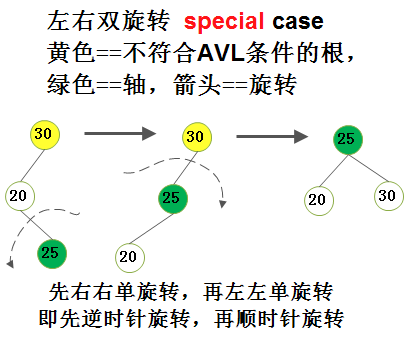
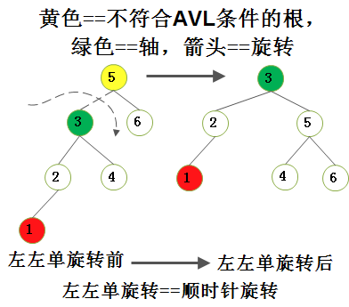
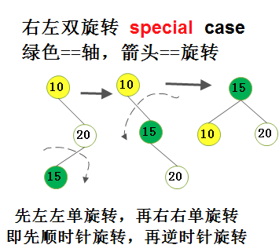
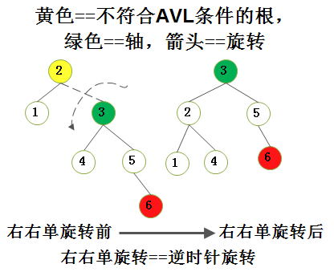
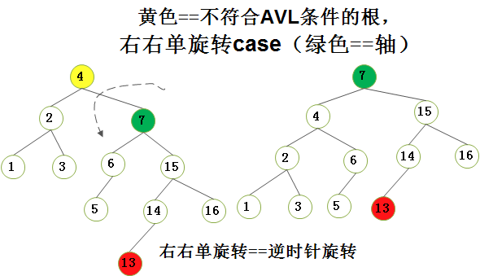
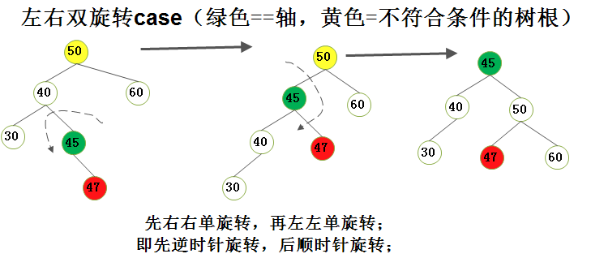
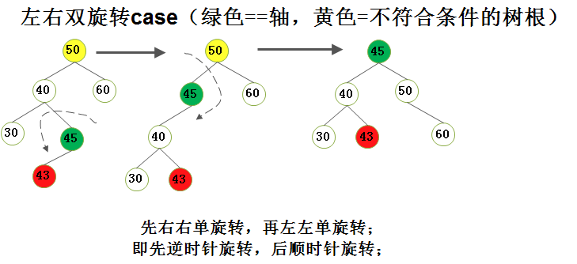
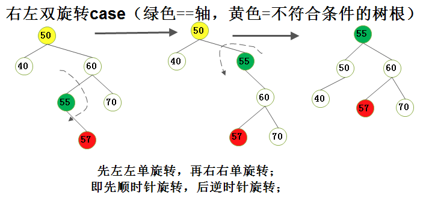
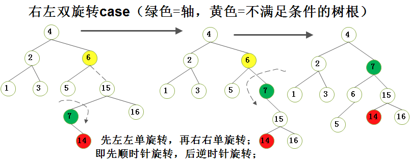
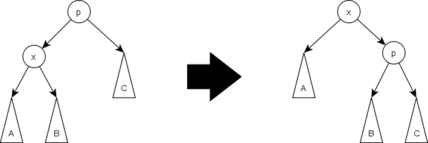

# Data structure and algorithm book notes（Description by Java）


##  引论

### 1. 递归

1. **基准情况**：在第一次不进行递归运算时，基本情况作为递归运算的终结条件必须存在。即必须要有某种基本的情形，它们不用递归就能求解。数学中，例如数列起始项 a1。
2. **不断推进**：对于要进行递归运算的情形，递归必须总能够朝着一个基准情况推进。
3. **设计合法**：假设所有的递归调用都能运行。
4. **合成效益法则**：compound interest rule.


### 2. Generic 泛型

​	参数化类型：将原来具体的类型参数化类似方法中的变量参数，此时类型也可以定义成参数形式，在调用时才传入具体的参数。

​	Java的基本思想是通过Object超类来实现泛型类（不仅限于Object类）。


------


## ALgorithm analysis 算法分析

- <font color="lightblue">Asymptotic Notation</font>

<font color="gree">Asymptotic Notation is used to describe the running time of an algorithm</font> - how much **time** an algorithm takes with a given input, n. 

There are three different notations: **<font color="red">big O, big Theta (Θ), and big Omega (Ω)</font>**. 

**big-Θ** is used when the running time is the **same for all cases**, 

**big-O** for the **worst case** running time, 

and **big-Ω** for the **best case** running time.


### 2.1 mathematical foundations


- Definition 2.1. 

T(N) = O(f(N)) if there are positive constants c and n0 such that T(N) ≤ cf(N) when N ≥ n0.


- Definition 2.2.

T(N) = (g(N)) if there are positive constants c and n0 such that T(N) ≥ cg(N) when N ≥ n0.

- Definition 2.3.

T(N) = (h(N)) if and only if T(N) = O(h(N)) and T(N) = (h(N)).

- Definition 2.4.

T(N) = o(p(N)) if for all positive constants c there exists an n0 such that T(N) < cp(N) when N > n0. Less formally, T(N) = o(p(N)) if T(N) = O(p(N)) and T(N) = (p(N))


***principle 1***：如果 
$$
T_1(N) = O(f(N))
$$
​		且
$$
T_2(N) = O(g(N))
$$
​		那么，

**（a）**
$$
T_1(N) + T_2(N) = O(f(N) + g(N))
$$
​		直观的和非正式地可以写成
$$
max(O(f(N)),O(g(N)))
$$
**(b)** 
$$
T_1(N) * T_2(N) = O(f(N) * g(N))
$$

------

***principle 2***: 如果
$$
T(N)
$$
是一个k次多项式，则
$$
T(N) = θ(N^k)
$$


------

***principle 3***: 对任意常数k，
$$
log^kN = O(N)
$$
这意味着对数增长的非常缓慢。

------


### 2.3 problem analysis

Sometimes, the time it takes to just read in the data from disk is likely orders of magnitude larger than the time required to solve the above problem. This is typical of many efficient algorithms. The reading of data is generally a bottleneck; once the data is read in, the problem is quickly resolved.


### 2.4 运行时间计算

#### **2.4.2 一般法则**

*principle1*：**for loop**

​		一个for循环的运行时间至多是该for 循环内部的语句（包括测试）的运行时间乘以迭代次数。


*principle2*：**嵌套for循环**

​		从里面向外分析这些循环。在一组嵌套循环内部的一条语句总的运行时间为该语句的运行时间乘以该组所有的for循环的大小的乘积。

eg:下列程序的时间复杂度为*O*(N^2)

```java
public class Test{
    public static void main(String[] args) {
        int k;
        for(int i = 0; i < n; i++){
            for(int j = 0; j < n; j++) {
                k++;
            }
        }
    }
}
```


*principle3* ：**sequential statement** 

​		将各个语句的运行时间求和即可。（即其中的最大值就是所得运行时间。[reason: 忽略级次较小的时间]）如下代码的运行时间为
$$
O（N^2）
$$


```c
#include<stdio.h>
int main(void)
{
    int array[5] = {12,34,34,23,98};
    for (int i = 0; i < n; i++)
    {
        a[i] = 0;
    }
    
    for (int i = 0; i < n; i++) 
    {
        for (int j = 0; j < n; j++) 
        {
            a[i] = a[j] + i + j;
        }
    }
    return 0;
}
```

​		

*principle4*: **if / else statement**

```java
if(condition)
    S1
else
    S2
```

For the above program snippet, the running time of an if/else statement never exceeds the running time of the judgment plus the total running time of the longer running time in S1 and S2.


#### 2.4.3 最大子序列和问题的求解（分治算法）

共计四种典型算法，较为特别的是使用**“分治”**方法的算法，使用动态规划的算法。

**eg: 分治算法**  

时间复杂度：
$$
T(1) = 1
$$

$$
T(N) = 2T(N/2) + O(N)
$$

最终计算得：

若
$$
N = 2^k
$$
则
$$
T(N) = N * (k + 1) = Nlog N + N = O(N log N)
$$


```java
public class MaxSunRec {

    public static void main (String[] args) {
        int[] array = {123, -9, -63, 30, 56, -10, 3, 30};
        System.out.println(maxSumRec(array, 0, 7));

    }
    /**
     * Recursive maximum contiguous subsequence sum algorithm.
     * Finds maximum sum in subarray spanning a[left...right]
     * Does not attempt to maintain actual best sequence.
     * @param a
     * @param left
     * @param right
     * @return
     */
    private static int maxSumRec(int[] a, int left, int right) {
        // base case
        if (left == right) {
            if (a[left] > 0) {
                return a[left];
            } else {
                return 0;
            }
        }

        int center = (left + right) / 2;
        // left part
        int maxLeftSum = maxSumRec(a, left, center);
        // right part
        int maxRightSum = maxSumRec(a, center + 1, right);

        // center part
        int maxLeftBorderSum = 0;
        int leftBorderSum = 0;
        for (int i = center; i >= left; i--) {
            leftBorderSum += a[i];
            if(leftBorderSum > maxLeftBorderSum) {
                maxLeftBorderSum = leftBorderSum;
            }
        }

        int maxRightBorderSum = 0;
        int rightBorderSum = 0;
        for(int i = center + 1; i <= right; i++) {
            rightBorderSum += a[i];
            if ( rightBorderSum > maxRightBorderSum) {
                maxRightBorderSum = rightBorderSum;
            }
        }

        return max(maxLeftSum, maxRightSum, maxLeftBorderSum + maxRightBorderSum);
    }

    private static int max(int number1, int number2, int number3) {
        int maxNumber = (number1 > number2 ? number1 : number2) > number3 ?
                (number1 > number2 ? number1 : number2) : number3;
        return maxNumber;
    }
}
```


eg： algorithm 4  p30 

```java
// algorithm 4  Linear-time maximum contiguous sum algorithm.
    private static int maxSubSum4(int[] a) {
        int maxSum = 0;
        int thisSum = 0;

        for (int i = 0; i < a.length; i++) {
            thisSum += a[i];

            if (thisSum > maxSum) {
                maxSum = thisSum;
            } else if (thisSum < 0) {
                thisSum = 0;
            }
        }
        return maxSum;
    }
```


#### 2.4.4 logarithm in running time 

*如果一个算法用常数时间将问题的大小削减为其一部分（通常是1/2）， 那么该算法就是O(logN)。另一方面， 如果使用常数时间只是把问题减少一个常数的数量（如将问题减少1）， 那么这种算法就是O(N)的。*


------


## Lists, stacks, and queues


### 3.1 Abstract data type, ATD 抽象数据类型


### 3.2 List ATD 


#### 3.2.1 表的简单实现


**扩展数组方法 Extended array method**    

```java
// 初始化一个长度为10的数组
int[] arr = new int[10];
...
// 扩大数组
// 对数组进行扩大处理
int[] newArr = new int[arr.length * 2]; 
for (int i = 0; i < arr.length; i++) {
    newArr[i] = arr[i];
}
arr = newArr;

```


#### 3.2.2 Singly Linked List  单链表

单链表为一系列节点组成，节点不必在内存中相连。每一个节点包含到该元素后面的节点的链，称next链。

- Simple Linked List CRUD

```java
// 访问头节点：O(1),遍历第一个节点就是头节点
/**
	访问尾节点：
	当尾节点不存在指向下一个节点的next指针，O(N),从第一个节点遍历到最后一个节点就是尾节点。
	当尾节点存在，O(1),在尾部节点可以通过next指针直接访问尾节点。
**/
// 访问中间节点：O(N),遍历到中间节点插入。
```

#### 3.2.3 Double Linked List 双链表

**双链表：** 每一个节点都持有一个指向它在表中的前驱节点的链。

``` java
// 访问头节点: O(1),遍历第一个节点就是头节点。
// 访问尾节点：O(1), 遍历尾节点也可以是头节点。
// 访问中间节点： O(N),遍历到中间第N个节点。
```


### 3.3  List in Collection API


#### **3.3.2 Iterator Interface** 

The main advantage of the Iterator `remove` method is that collection `remove` should find the item which will be deleted. In some cases, the Iterator is more effective than the Collection.  We use Iterator when needed. However, if Iterator called its own remove method, this Iterator is legal.  


Notice： If you want to change the structure of the collection (like use add, remove, clear method), this collection will be illegal. (And it will throw a `ConcurrentModificationException` after this situation. )

 

#### **3.3.3 List Interface, ArrayList Class and LinkedList Class**


ArrayList class's advantage is that calls to get and set use constant time. But it's not effective in some situations. Such as adding the new items into the ArrayList, unless the change is made at the end of the ArrayList. And the LinkedList class provides a doubly-linked list implementation of the List ADT.

LinkedList class's advantage is that adding the new items and deleting the old items both have a small overhead(开销). (The default assumes that the position of the variable is known) It means that adding and deleting the items at the front of the LinkedList use operate in constant time.


### 3.4 The implementation of the ArrayList class


This is an example program as follows:

**MyArrayList**    *p47*

```java
package chapter3;

import java.util.Iterator;

/**
 * The implement of ArrayList class.
 */
public class MyArrayList<E> implements Iterable<E> {

    private static final int DEFAULT_CAPACITY = 10;

    private int theSize;
    private E[] theItems;

    public MyArrayList() {
        doClear();
    }

    public void clear() {
        doClear();
    }

    private void doClear() {
        theSize = 0;
        ensureCapacity(DEFAULT_CAPACITY);
    }

    public int size() {
        return theSize;
    }

    public boolean isEmpty() {
        return size() == 0;
    }

    // change array size
    public void trimToSize() {
        ensureCapacity(size());
    }

    public E get(int index) {
        if (index < 0 || index >= size()) {
            throw new ArrayIndexOutOfBoundsException();
        }
        return theItems[index];
    }

    public E set(int index, E newValue) {
        if (index < 0 || index >= size()) {
            throw new ArrayIndexOutOfBoundsException();
        }
        E old = theItems[index];
        theItems[index] = newValue;
        return old;
    }

    // initialize the arrayList size
    public void ensureCapacity(int newCapacity) {
        // Shrink the array size
        if (newCapacity < theSize) {
            return;
        }
        /*  It is unlawful to create generic array.
            We can create an array of generic type bounds and then use an array for type conversion.
            This will generate a compile warning, but is unavoidable in the implementation of generic collections.
        */
        E[] old = theItems;
        theItems = (E[]) new Object[newCapacity];
        for (int i = 0; i < size(); i++) {
            theItems[i] = old[i];
        }
    }

    // add method 1
    public boolean add(E x) {
        add(size(), x);
        return true;
    }

    // add method 2
    public void add(int index, E x) {
        if (theItems.length == size()) {
            ensureCapacity(size() * 2 + 1);
            for (int i = theSize; i > index; i--) {
                theItems[i] = theItems[i - 1];
            }
            theItems[index] = x;
            theSize++;
        }
    }


    public E remove(int index) {
        E removedItem = theItems[index];
        for (int i = index; i < size() - 1; i++) {
            theItems[i] = theItems[i + 1];
        }
        theSize--;
        return removedItem;
    }


    @Override
    public java.util.Iterator<E> iterator() {
        return new ArrayListIterator();
    }

    private class ArrayListIterator implements java.util.Iterator<E> {

        private int current = 0;

        @Override
        public boolean hasNext() {
            return current < size();
        }

        public E next() {
            if (!hasNext()) {
                throw new java.util.NoSuchElementException();
            }
            return theItems[current++];
        }

        public void remove() {
            MyArrayList.this.remove(--current);
        }
    }
}

```


#### 3.4.2 The Iterator and Java Nested and Inner Classes

1. *p50*

**postfix ++ operator** and **prefix ++ operator** used in `arr[idx]`   (`arr[++idx] arr[idx++]`)

2. *p50*

**package visibility** 


- Nested class  *p50*

Make the `ArrayListIterator` class a nested class, When we make `ArraylistIterator` a nested class, it is placed inside of another class (in this case `MyArrayList`) which is the **outer class**. We must use the word **`static`** to signify that it is nested; without **`static`**, we will get an inner class, which is sometimes good and sometimes bad.  

- Inner class *p51*

When you declare an inner class, the compiler adds an implicit reference to the outer class object that caused the inner class object's construction. If the name of the outer class is `Outer`, then the implicit reference is `Outer.this.` Thus if `ArrayListIterator` is declared as an inner class, without the static, then `MyArrayList.this` and `theList` would both be referencing the same `MyArrayList`. Thus `theList` would be redundant and could be removed.


------


### 3.5 Implementation of LinkedList

Doubly linked list 

These extra nodes are sometimes known as **sentinel nodes**; specifically, the node at the front is sometimes known as a **header node**;  and the node at the end is sometimes known as a **tail node**.


```java
package chapter3;

import java.util.ConcurrentModificationException;

/**
 * The implementation of the LinkedList
 */
public class MyLinkedList<T> implements Iterable<T> {


    // node generic class
    private static class Node<T> {
        public Node(T d, Node<T> p, Node<T> n) {
            data = d;
            prev = p;
            next = n;
        }

        public T data;
        public Node<T> prev;
        public Node<T> next;
    }

    public MyLinkedList() {
        doClear();
    }

    public void clear() {
        doClear();
    }

    private void doClear() {
        // Create a begin marker and a end marker.Set the size equals 0;
        beginMarker = new Node<T>(null, null, null);
        endMarker = new Node<T>(null, beginMarker, null);
        beginMarker.next = endMarker;

        theSize = 0;
        modCount++;
    }

    public int size() {
        return theSize;
    }

    public boolean isEmpty() {
        return size() == 0;
    }

    public boolean add(T x) {
        add(size(), x);
        return true;
    }

    public void add(int idx, T x) {
        addBefore(getNode(idx, 0, size()), x);
    }

    public T get(int idx) {
        return getNode(idx).data;
    }

    public T set(int idx, T newVal) {
        Node<T> p = getNode(idx);
        T oldVal = p.data;
        p.data = newVal;
        return oldVal;
    }

    public T remove(int idx) {
        return remove(getNode(idx));
    }

    /**
     * Add an item to this collection, at specified position p;
     * Items at or after that position are slid one position higher.
     *
     * @param p Node to add before
     * @param x any object
     * @thorws IndexOutOfBoundsException if idx is not between 0 and size().
     */
    private void addBefore(Node<T> p, T x) {
        /*
            This part can be short like this:

            1>
            Node newNode = new Node(x, p.prev, p);
            p.prev = p.prev.next = newNode;

            2>
            p.prev = p.prev.next = new Node(x, p.prev, p);

         */
        Node<T> newNode = new Node<>(x, p.prev, p);
        newNode.prev.next = newNode;
        p.prev = newNode;
        theSize++;
        modCount++;
    }

    /**
     * Remove the object contains in Node p;
     *
     * @param p the Node containing the object.
     * @return the item was removed from the collection.
     */
    private T remove(Node<T> p) {
        p.next.prev = p.prev;
        p.prev.next = p.next;
        theSize--;
        modCount++;

        return p.data;
    }


    /**
     * Gets the Node at position idx, which must range from 0 to size() - 1.
     *
     * @param idx idx index to search at.
     * @return internal node corresponding to idx.
     * @throws IndexOutOfBoundsException if idx is not
     *                                   between 0 and size() - 1, inclusive.
     */
    private Node<T> getNode(int idx) {
        return getNode(idx, 0, size() - 1);
    }

    /**
     * Gets the Node at position idx, which must range from lower to upper.
     *
     * @param idx   index to search at.
     * @param lower Lowest valid index.
     * @param upper Highest valid index.
     * @return internal node corresponding to idx.
     * @throws IndexOutOfBoundsException if id is not
     *                                   between lower and upper, inclusive.
     */
    private Node<T> getNode(int idx, int lower, int upper) {
        Node<T> p;

        if (idx < lower || idx > upper) {
            throw new IndexOutOfBoundsException();
        }

        if (idx < size() / 2) {
            p = beginMarker.next;
            for (int i = 0; i < idx; i++) {
                p = p.next;
            }
        } else {
            p = endMarker;
            for (int i = size(); i > idx; i--) {
                p = p.prev;
            }
        }

        return p;
    }

    public java.util.Iterator<T> iterator() {
        return new LinkedListIterator();
    }

    private class LinkedListIterator implements java.util.Iterator<T> {
        private Node<T> current = beginMarker.next;
        private int expectedModCount = modCount;
        private boolean okToRemove = false;


        @Override
        public boolean hasNext() {
            return current != endMarker;
        }

        public T next() {
            if (modCount != expectedModCount) {
                throw new java.util.ConcurrentModificationException();
            }
            if (!hasNext()) {
                throw new java.util.NoSuchElementException();
            }

            T nextItem = current.data;
            current = current.next;
            okToRemove = true;
            return nextItem;
        }

        public void remove() {
            if (modCount != expectedModCount) {
                throw new ConcurrentModificationException();
            }
            if (!okToRemove) {
                throw new IllegalStateException();
            }

            MyLinkedList.this.remove(current.prev);
            expectedModCount++;
            okToRemove = false;

        }
    }

    private int theSize;
    private int modCount = 0;
    private Node<T> beginMarker;
    private Node<T> endMarker;


}

```


------


### 3.6 The Stack ADT

#### 3.6.1 Stack Model

- Stack is sometimes known as **LIFO (last in, first out)** lists. 

- The general model is that there is some element that is at the top of the stack, and it is the only element that is visible.


#### 3.6.2 Implementation of Stacks

**Linked List Implementation of Stacks**

**Array Implementation of Stacks**


#### 3.6.3 Applications


- Balancing Symbols

- **Postfix Expressions**

Postfix notation, or reverse Polish notation, the easiest way to do this is to use the stack. When a number is seen, it is pushed onto the stack; when an operator is seen, the operator is applied to the two numbers(symbols) that are popped from the stack, and the result is pushed onto the stack. 

```java
package chapter3;

/**
 * Java program to evaluate value of a postfix
 * expression having multiple digit operands
 */


import java.util.Stack;

class PostfixExpression {
    // Method to evaluate value of a postfix expression
    public static int evaluatePostfix(String exp) {
        //create a stack
        Stack<Integer> stack = new Stack<>();

        // Scan all characters one by one
        for (int i = 0; i < exp.length(); i++) {
            char c = exp.charAt(i);

            if (c == ' ') {
                continue;
            }
                // If the scanned character is an operand(number here),
                // extract the number
                // Push it to the stack.
            else if (Character.isDigit(c)) {
                int n = 0;

                //extract the characters and store it in num
                while (Character.isDigit(c)) {
                    n = n * 10 + (int) (c - '0');
                    i++;
                    c = exp.charAt(i);
                }
                i--;

                //push the number in stack
                stack.push(n);
            }

            // If the scanned character is an operator, pop two
            // elements from stack apply the operator
            else {
                int val1 = stack.pop();
                int val2 = stack.pop();

                switch (c) {
                    case '+':
                        stack.push(val2 + val1);
                        break;

                    case '-':
                        stack.push(val2 - val1);
                        break;

                    case '/':
                        stack.push(val2 / val1);
                        break;

                    case '*':
                        stack.push(val2 * val1);
                        break;
                }
            }
        }
        return stack.pop();
    }

    // Driver program to test above functions
    public static void main(String[] args) {
        String exp = "100 200 + 2 / 5 * 7 +";
        System.out.println(evaluatePostfix(exp));
    }
}
```


##### Infix to Postfix Conversion (important)


- 几个注意事项

1. 中缀转后缀时，需要一个读取域、一个栈及一个输出域；
2. 读取域中存放将要被转换的中缀表达式（标准表达式）；
3. 数据去向基本路线：读取域 ------> 栈（停留或不停留） ------> 输出域；
4. 所有操作数都将从读取域经过堆栈并直接输出到输出域；
5. 运算操作符（即加减乘除等）从读取域被读取并进入堆栈；
6. 当堆栈为空时，读取到操作符时直接将操作符压入堆栈；
7. 当堆栈不为空时，**比较栈顶元素（栈顶操作符）与被读取（current）到的操作符的优先级（precedence），通过操作符的优先级判断即将进行的操作**；***若栈顶操作符的优先级低于被读取到的操作符的优先级，则不输出栈顶操作符，直接将读取到的操作符压入堆栈；若栈顶操作符的优先级高于被读取到的操作符的优先级，则先将栈顶操作符输出，再将被读取到的操作符压入堆栈***；

```java
Stack<E> stack = new Stack<>();
if (operatorStackTop.precedence() < operatorRead.precedence()) {
	stack.push(operatorRead);     
}

if (operatorStackTop.precedence() > operatorRead.precedence()) {
    outputField = operatorStackTop;
    stack.push(operatorRead);
}
```

8. 关于圆括号：圆括号进行特殊处理。一般而言，**（ 左括号具有最高优先级**，当进行压栈时，无论栈顶是什么操作符，（的优先级都是较高的；**当读取到一个）右括号时，将堆栈中（之上所有的操作符全部输出**，最终舍弃左右括号。


eg:

```java
package chapter3;

import java.util.Scanner;
import java.util.Stack;

public class InfixToPostfix {

    /**
     * Checks if the input is operator or not
     * @param c input to be checked
     * @return true if operator
     */
    private boolean isOperator(char c){
        if(c == '+' || c == '-' || c == '*' || c =='/' || c == '^')
            return true;
        return false;
    }

    /**
     * Checks if c2 has same or higher precedence than c1
     * @param c1 first operator
     * @param c2 second operator
     * @return true if c2 has same or higher precedence
     */
    private boolean checkPrecedence(char c1, char c2){
        if((c2 == '+' || c2 == '-') && (c1 == '+' || c1 == '-'))
            return true;
        else if((c2 == '*' || c2 == '/') && (c1 == '+' || c1 == '-' || c1 == '*' || c1 == '/'))
            return true;
        else if((c2 == '^') && (c1 == '+' || c1 == '-' || c1 == '*' || c1 == '/'))
            return true;
        else
            return false;
    }

    /**
     * Converts infix expression to postfix
     * @param infix infix expression to be converted
     * @return postfix expression
     */
    public String convert(String infix){
        System.out.printf("%-8s%-10s%-15s\n", "Input","Stack","Postfix");
        String postfix = "";  //equivalent postfix is empty initially
        Stack<Character> s = new Stack<>();  //stack to hold symbols
        s.push('#');  //symbol to denote end of stack

        System.out.printf("%-8s%-10s%-15s\n", "",format(s.toString()),postfix);

        for(int i = 0; i < infix.length(); i++){
            char inputSymbol = infix.charAt(i);  //symbol to be processed
            if(isOperator(inputSymbol)){  //if a operator
                //repeatedly pops if stack top has same or higher precedence
                while(checkPrecedence(inputSymbol, s.peek()))
                    postfix += s.pop();
                s.push(inputSymbol);
            }
            else if(inputSymbol == '(')
                s.push(inputSymbol);  //push if left parenthesis
            else if(inputSymbol == ')'){
                //repeatedly pops if right parenthesis until left parenthesis is found
                while(s.peek() != '(')
                    postfix += s.pop();
                s.pop();
            }
            else
                postfix += inputSymbol;
            System.out.printf("%-8s%-10s%-15s\n", ""+inputSymbol,format(s.toString()),postfix);
        }

        //pops all elements of stack left
        while(s.peek() != '#'){
            postfix += s.pop();
            System.out.printf("%-8s%-10s%-15s\n", "",format(s.toString()),postfix);

        }

        return postfix;
    }

    /**
     * Formats the input  stack string
     * @param s It is a stack converted to string
     * @return formatted input
     */
    private String format(String s){
        s = s.replaceAll(",","");  //removes all , in stack string
        s = s.replaceAll(" ","");  //removes all spaces in stack string
        s = s.substring(1, s.length()-1);  //removes [] from stack string

        return s;
    }

    public static void main(String[] args) {
        InfixToPostfix obj = new InfixToPostfix();
        Scanner sc = new Scanner(System.in);
        System.out.print("Infix : \t");
        String infix = sc.next();
        System.out.print("Postfix : \t"+obj.convert(infix));
    }
}
```


##### Method transfer

Method transfer is used to execute with a stack. All of the store information is called **"activation record"**, or **"stack frame"**.

**Tail recursion**

关于尾递归

```
function story() {

从前有座山，山上有座庙，庙里有个老和尚，一天老和尚对小和尚讲故事：story() // 尾递归，进入下一个函数不再需要上一个函数的环境了，得出结果以后直接返回。

}

function story() {

从前有座山，山上有座庙，庙里有个老和尚，一天老和尚对小和尚讲故事：story()，小和尚听了，找了块豆腐撞死了 // 非尾递归，下一个函数结束以后此函数还有后续，所以必须保存本身的环境以供处理返回值。

}
```


The recursive routine is always being removed completely. Generally speaking, recursive programs are often slower than equivalence routines. But at the same time, the faster execution speed brings the loss of the clear logic of the recursive program.


------


### 3.7 Queue ADT

#### 3.7.1 Queue model

1. enqueue: Add an element at the "**rear**" of the queue.
2. dequeue: Remove an element at the "**front**" of the queue.

#### 3.7.2 Array implement of Queue

```java
package chapter3;

import java.util.Scanner;

/**
 * This class used to study some queue implement.
 */
public class MyQueue {

    // Initial array to store the queue
    // 默认将数组左侧设为队头，将数组右侧设为队列尾。队列从头出队（删除元素），从尾入队（添加元素）。
    int[] capacity;
    // currentSize is the length of the queue.
    private int size = 0;
    // the pointer of the queue front.
    private int front = 0;
    // the pointer of the queue rear.
    private int back = 0;

    public void inputCapacityLength(){
        System.out.println("please input the length of the Capacity:");
        Scanner sc = new Scanner(System.in);
        int CapacityLength = sc.nextInt();
        capacity = new int[CapacityLength];
    }
    // 默认状态下队列为空， 所以 front == rear == 0.
    // insert element. Only insert one element at the same time.
    // 添加元素，操作队尾，即数组左
    // 首先将队列大小+1即向右扩大，然后将back（队尾指针）+1（向右移动），
    // 再将队尾元素赋值为e.
    public void enqueue(int e) {
        // 判断队列是否为满，为满则抛出异常，退出方法;如果不为满，则正常添加元素
        capacity[back] = e;
        size++;
        back++;
    }

    // remove element. Only remove one element at the same time.
    public int dequeue() {
        size--;
        front++;

        return capacity[front];
    }

    public boolean isFull() {
        if (size == capacity.length) {
            return true;
        } else {
            return false;
        }
    }

    public static void main(String[] args) {
        MyQueue q = new MyQueue();
        Scanner scn = new Scanner(System.in);
        q.inputCapacityLength();
        for (int i = q.front; i < q.back - 1; i++) {
            int element = scn.nextInt();
            q.enqueue(element);
        }

        // 遍历数组capacity，将每一位元素都输出
        for (int i = 0; i < q.capacity.length; i++) {
            System.out.println(i);
        }

        System.out.println();
        q.dequeue();

        for (int i = q.front; i < q.back; i++) {
            System.out.println(q.capacity[i]);
        }
    }
}
```


### Complexity Analysis about Dynamic Array and Static Array 

#### 静态数组

静态数组，亦称静态阵列，在内存中以连续的数据集合保存，每一次插入数据都需要判断空白内存的整体性和连续性，由于数据在内存中是随机存储的，因此存在多个空白区域。对于一个已经存在于内存地址中的静态阵列，如果在插入新数据之后，原本的空白内存地址大小不足以存储新的静态阵列，那么系统将在内存中重新寻找连续内存块，直到找到能够完整存储新阵列的内存块，并将原本的阵列拷贝，加上新数据然后插入到新的空白内存地址。此操作可以称为<font color=red>插入转移</font>。

- 可以得出，静态阵列在阵列末尾插入时间为**O(1)**，考虑极限, 每次在阵列首地址或中间地址插入需要**O(N)**；
- 删除操作同理，在阵列末地址删除花费**O(1)**，在阵列首地址或中间地址删除，由于需要将删除元素之后的元素前移，从而保持连续性，故需要花费**O(N)**。


<font color=blue>Static Array JVM operation Mark Sweep GC 标记清除算法</font>
*——jvm垃圾回收相关*

如果每次删除都在静态数组首地址或中间地址删除一个元素，一次删除花费O(N)，多次将花费O(N^2)。针对这种情况，jvm使用Mark Sweep 方法，每次不删除元素，而是将元素标记，之后多次删除执行完毕之后，确认删除元素，然后将所有已标记的元素删除。

#### 动态数组

- 动态数组，动态阵列。与静态数组一样，在内存中以连续内存地址块存储数据。不同点在于动态阵列每次插入并非只扩展一个元素或需要插入元素的内存地址大小，而是每次增加一阵列地址大小的一倍，如此以来，只有遇到一倍地址时插入元素才需要花费O(N)，其他则都为O(1)。如此多次扩展后，动态阵列的扩展呈现<font color=red>级数收敛</font>的状态。这种分析也称Dynamic Array Amortized Analysis **平摊分析**。


## Tree

Binary search tree, you will see the following purpose of the tree:

- Implement file systems in several popular operating systems
- Evaluate the value of an arithmetic expression
- Perform various search operations in O(log N) average time
- TreeSet class, TreeMap class


### 4.1 Preliminary knowledge

Some keywords:

A tree consists of  N nodes and N-1 edges.

- **root**
- **edge**
- **child**
- **parent**
- **leaf**
- **siblings(兄弟)**
- **grandparent**
- **grandchild**
- **path**: a sequence about *n1* to *nk*. 
- **length**: how many edges in the path
- **depth**:  the length of the unique path form root to *ni*.
- The depth of a tree is equal to the depth of its deepest leaf
- **height**: The length of the longest path from ni to a leaf
- **ancestor**: If there is a path from n1 to n2, then n1 is an ancestor of n2.
- **proper ancestor**: If n1 is not equal to n2, then n1 is the true ancestor of n2 and n2 is the true descendant of n1

- 度：结点拥有的子树的个数为度；一个树的度为所有结点中最高的度。

------


#### 4.1.1 implementation of the tree


- Place all the sons of each node in the linked list of tree nodes    将每个节点的所有的儿子都放在树节点的链表中


#### 4.1.2 application and traversal of the tree

implement file system 

A tree routine example:

```java
class TreeNode {
	Object element;
    TreeNode firstChild;
    TreeNode nextSibling;
}
```

**preorder traversal**

**postorder traversal**


### 4.2 Binary tree

The binary tree uses in designing compiler.

- The average depth of a binary tree is

$$
O(\sqrt{N})
$$

- The average depth of a binary search tree is 

  
  $$
  O(logN)
  $$
  

#### 4.2.1 implement

a routine example of the binary tree:

```java
class BinaryNode {
    Object element;
    BinaryNode left;
    BinaryNode right;
}
```


#### 4.2.2 Expression tree

keyword: nodes are operators,  leaves are operands.  


### 4.3 The Search Tree ADT - Binary Search Trees

The property that makes a binary tree into a binary search tree is that for every node X, in the tree, the values of all the items in its left subtree are smaller than the item in X, and the values of all the items in its right subtree are larger than the item in X.


Example routine:

```java
package chapter4;

import java.nio.BufferUnderflowException;

public class BinarySearchTree<T extends Comparable<? super T>> {
    // node nested class
    private static class BinaryNode<T> {
        // constructors
        // leaves
        BinaryNode(T theElement) {
            this(theElement, null, null);
        }

        // nodes
        BinaryNode(T theElement, BinaryNode<T> lt, BinaryNode<T> rt) {
            element = theElement;
            left = lt;
            right = rt;
        }

        T element;
        BinaryNode<T> left;
        BinaryNode<T> right;
    }

    private BinaryNode<T> root;

    public BinarySearchTree() {
        root = null;
    }

    public void makeEmpty() {
        root = null;
    }

    public boolean isEmpty() {
        return root == null;
    }

    public boolean contains(T x) {
        return contains(x, root);
    }

    public T findMin() {
        if (isEmpty()) {
            throw new BufferUnderflowException();
        }

        return findMin(root).element;
    }

    public T findMax() {
        if (isEmpty()) {
            throw new BufferUnderflowException();
        }

        return findMax(root).element;
    }

    public void insert(T x) {
        root = insert(x, root);
    }

    public void remove(T x) {
        root = remove(x, root);
    }

    /**
     * Print the tree contains in sorted order.
     */
    public void printTree() {
        if (isEmpty()) {
            System.out.println("Empty tree");
        } else {
            printTree(root);
        }
    }

    /**
     * Internal method to find an item in a subtree.
     *
     * @param x is item to search for.
     * @param t the node that roots the subtree.
     * @return true if the item is found; false otherwise.
     */
    private boolean contains(T x, BinaryNode<T> t) {
        if (t == null) {
            return false;
        }

        int compareResult = x.compareTo(t.element);

        if (compareResult < 0) {
            return contains(x, t.left);
        } else if (compareResult > 0) {
            return contains(x, t.right);
        } else {
            return true;
        }
    }

    /**
     * Internal method to find the smallest item in a subtree.
     *
     * @param t the node that roots the subtree.
     * @return node containing the smallest item.
     */
    private BinaryNode<T> findMin(BinaryNode<T> t) {
        if (t == null) {
            return null;
        } else if (t.left == null) {
            return t;
        }

        return findMin(t.left);
    }

    /**
     * Internal method to find the largest item in a subtree.
     *
     * @param t the node that roots the subtree.
     * @return node containing the largest item.
     */
    private BinaryNode<T> findMax(BinaryNode<T> t) {
        if (t != null) {
            while (t.right != null) {
                t = t.right;
            }
        }

        return t;
    }

    /**
     * Internal method to insert into a subtree.
     * To insert X into tree T, proceed down the tree as you would with a contains. If X is found, do nothing or update
     * something. Otherwise, insert X at the last spot on the path traversed.
     *
     * @param x the item to insert
     * @param t the node that roots the subtree.
     * @return the new root to of the subtree.
     */
    private BinaryNode<T> insert(T x, BinaryNode<T> t) {
        if (t == null) {
            return new BinaryNode<>(x, null, null);
        }

        int compareResult = x.compareTo(t.element);

        if (compareResult < 0) {
            t.left = insert(x, t.left);
        } else if (compareResult > 0) {
            t.right = insert(x, t.right);
        } else {
            ;
        }

        return t;
    }

    private BinaryNode<T> remove(T x, BinaryNode<T> t) {
        if (t == null) {
            // item not found, do nothing.
            return t;
        }

        int compareResult = x.compareTo(t.element);

        if (compareResult < 0) {
            t.left = remove(x, t.left);
        } else if (compareResult > 0) {
            t.right = remove(x, t.right);
        } else if (t.left != null && t.right != null) { // two children
            t.element = findMin(t.right).element;
            t.right = remove(t.element, t.right);
        } else {
            t = (t.left != null) ? t.left : t.right;
        }

        return t;
    }

    /**
     * internal method to print a subtree in sorted order.
     *
     * @param t the node that roots the subtree.
     */
    private void printTree(BinaryNode<T> t) {
        if (t != null) {
            printTree(t.left);
            System.out.println(t.element);
            printTree(t.right);
        }
    }

}
```

------


#### 4.3.2 `findMax` method and `findMin` method 

Noice how we carefully handle the degenerate case of an empty tree and **it's always especially crucial in recursive programs**. 

*Code was implemented above.*


#### 4.3.3 insert method

*Code was implemented above.*


#### 4.3.4 remove method

*Code was implemented above.*


- lazy deletion:

>When an element is to be deleted,it isleft in the tree and merely marked as being deleted. This is especially popular if duplicate items are present, because then the field that keeps count of the frequency of appearance can be decremented. If the number of real nodes in the tree is the same as the number of "deleted" nodes, then the depth of the tree is ongly expected to go up by a small constant, so there is a very small time penalty associated with lazy deletion. Also, if a deleted item is reinserted, the overhead of allocating a new cell is avoided.


#### 4.3.5 Average-Case Analysis

- Internal path length: all of the deepth about nodes in a tree.
- 删除操作中，可以通过随机选取右子树的最小元素或左子树的最大元素来代替被删除的以消除这种不平衡问题。


------


### 4.4 AVL tree

- Adelson-Velskii Landis tree is a binary search tree with a balance condition.The balance condition must be easy to maintain, and it ensures that the depth of the tree is O(logN). The simplest idea is to require that the left and right subtrees have the same height.
- An AVL tree is identical to a binary search tree, except that for every node in the tree, the height of the left and right subtrees can differ by at most 1. (The height of an empty tree is defined to be −1.)一颗AVL树是其每个节点的左子树和右子树的高度最多差一的二叉查找树（空树高度定义为-1）。
- Height information is kept for each node (in the node structure).


*AVL 树与斐波那契数密切相关*

>设AVL树的高度为*h*，最少节点数S(h)为
>$$
>S(h) = S(h-1) + S(h-2) + 1
>$$
>对于h=0，S(h) = 1; h = 1, S(h)= 2;


#### Rotation 旋转

为了平衡AVL树，可以使用**旋转**来控制查找二叉树的结构以满足AVL树的条件。

插入操作和删除操作都会改变AVL树的平衡条件，这里先讨论插入操作。

After an insertion, only nodes that are on the path from the insertion point to the root might have their balance altered because only those nodes have their subtrees altered. As we follow the path up to the root and update the balancing information, we may find a node whose new balance violates the AVL condition. We will show how to rebalance the tree at the first (i.e., deepest) such node.

Let us call the node that must be rebalanced α. Since any node has at most two children, and a height imbalance requires that α’s two subtrees’ height differ by two, it is easy to see that a violation might occur in four cases: 

1.  An insertion into the left subtree of the left child of α. 
2.  An insertion into the right subtree of the left child of α. 
3.  An insertion into the left subtree of the right child of α. 
4.  An insertion into the right subtree of the right child of α


```
										*    --->  alpha
									  /   \
									 *     *
								    / \   / \
								   *   * *   *
								   1   2 3   4
```


情况一：插入发生在”外边“， 即左-左or右-右。该情况使用single rotation 单旋转。

情况二：插入发生在“内部”，即左-右or右-左。该情况使用double rotation 双旋转。


**旋转涉及两个问题：旋转轴和旋转方向；**

- **单旋转：**旋转轴为 不满足AVL条件的最小树的树根的**相应孩子节点**；
- **多旋转：**旋转轴为 不满足AVL条件的最小树的树根的**相应孙子节点**；


**判断单双旋转的方法：**

- 单旋转：插入点不介于**不满足AVL条件的树根**和**树根对应孩子节点**之间；
- 双旋转：插入点介于**不满足AVL条件的树根**和**树根对应孩子节点**之间；


#### 4.4.1 single rotation 

**左左旋转（顺时针旋转）**： 从插入点回溯到第一个不满足AVL条件的节点；本例中，插入点是10， 而第一个不满足AVL条件的节点是30；将回溯路径上的节点除节点30外，上移一层，节点30下移一层；

- case1

>1. 
>
>
>2. 
>
>
> *（这是一个左右双旋转特例，当不符合AVL条件的树根和插入点的父节点只有一个子节点，且相反方向的子节点，当然了，插入点要介于树根和插入点父节点之间的话，才满足 双旋转特例的条件）*


*Attention 1）*因为10 小于 20 且 小于30； 所以通过一次单旋转就可以完成；**也即是， 左左单旋转时， 不满足AVL条件的最小树的根应该下移，该树的其他节点上移，而不管 该树的左子树的右孩子 或者存在 或者 不存在，在旋转过程中，都要把该左子树的的右孩子添加以作为最小树根的左孩子，因为即使不存在，添加null 也不影响最后的旋转效果**。


- case2

>


**左左单旋转的java实现：**

```java
private AvlNode<T> rotateWithLeftChild(AvlNode<T> k2) {
        AvlNode<T> k1 = k2.left;
        k2.left = k1.right;
        k1.right = k2;
        k2.height = Math.max(height(k2.left), height(k2.right)) + 1;
        k1.height = Math.max(height(k1.left), k2.height) + 1;
        return k1;
    }
```


------


**右右旋转（逆时针旋转）：** 从插入点回溯到第一个不满足AVL条件的节点；本例中，插入点是10， 而第一个不满足AVL条件的节点是30；将回溯路径上的节点除节点30外，上移一层，节点30下移一层；


- case1

>1. 
>  
>
>2.  
>
>  *（这是一个右左双旋转特例，当不符合AVL条件的树根和插入点的父节点只有一个子节点，且相反方向的子节点，当然了，插入点要介于树根和插入点父节点之间的话，才满足 双旋转特例的条件）*


*Attention 2）*因为10 小于 20 且 小于30； 所以通过一次单旋转就可以完成；**也即是， 右右单旋转时， 不满足AVL条件的最小树的根应该下移，该树的其他节点上移，而不管 该树的右子树的左孩子 或者存在 或者 不存在，在旋转过程中，都要把该右子树的左孩子添加以作为最小树根的右孩子，因为即使不存在，添加null 也不影响最后的 旋转效果**。

- case2

>


- case3
>为什么经过右右单旋转就可以修正成为 AVL 树；因为 new point = 13 不在 4 和 7 之间， 所以一次单旋转就可以了，无需双旋转；**也就是说，new point 介于 不满足AVL条件的树根 和 其 孩子 之间的话，那么就需要双旋转， 否则， 只需要单旋转就可以了。**
>
>


**右右单旋转的java实现**

```java
private AvlNode<T> rotateWithRightChild(AvlNode<T> k4) {
        AvlNode<T> k3 = k4.right;
        k4.right = k3.left;
        k3.left = k4;
        k4.height = Math.max(height(k3.right), height(k3.left)) + 1;
        k3.height = Math.max(height(k4.right), k4.height) + 1;
        return k3;
    }
```


>**Conclusion of single rotation）单旋转有两个属性： 轴 和 旋转方向
>C1）单旋转的轴： 相信你也看到了， 单旋转的轴显然是不符合AVL条件的树根的直接孩子；
>	C1.1）左左单旋转的轴：是不符合AVL条件的树根的左孩子；
>	C1.2）右右单旋转的轴：是不符合AVL条件的树根的右孩子；
>C2）旋转方向：
>	C2.1）左左单旋转方向：顺时针方向；
>	C2.2）右右单旋转方向：逆时针方向；**


#### 4.4.2 double rotation

**左右双旋转：** （先左左单旋转，再右右单旋转； 即先顺时针旋转，后逆时针旋转）

- case 1

>因为47 介于 40 和 50 之间， 所以肯定需要双旋转；
>
>1. 
>
>
>
>```java
>private doubleRotateWithLeftChild(AvlNode 50) {
>    // step 1, 2
>    50.left(40) = rotateWithRightChild(AvlNode 50.left(40));
>    // step 3
>    return rotateWithLeftChild(50);
>}
>```
>
>
>
>2. 
>
>
>
>


**右左双旋转：**先将节点15向上提，还是不满足AVL树的条件，再把节点7向上提；（先右右单旋转，再左左单旋转； 即先逆时针旋转，后顺时针旋转）
>1. 
>
>2. 
>
>
>
>

**右左双旋转java实现**

```java
private AvlNode<T> doubleRotateWithRightChild(AvlNode<T> k6) {
        k6.right = rotateWithLeftChild(k6.right);
        return rotateWithRightChild(k6);
    }
```


>**Conclusion of double rotations） 双旋转有两个属性： 轴 和 旋转方向
>C1）双旋转的轴：相信你也看到了，双旋转的轴显然是插入点的直接父节点；（除了两个特例）双旋转的轴显然是插入点的直接父节点（除了两个特例， 而两个特例的轴是插入点本身）
>	C1.1）左右单旋转的轴：插入点的父节点；
>	C1.2）右左单旋转的轴：插入点的父节点；
>C2）旋转方向：
>	C2.1）左右单旋转方向：先右右单旋转，再左左单旋转；即先逆时针旋转，再顺时针旋转；
>	C2.2）右左单旋转方向：先左左单旋转，再右右单旋转；即先顺时针旋转，再逆时针旋转；**



[来源：AVL树的单双旋转](https://blog.csdn.net/PacosonSWJTU/article/details/50522677)

#### *参考

[参考视频](https://www.bilibili.com/video/BV1dr4y1j7Mz/?spm_id_from=333.788&vd_source=954d877e1b30cd12d08f2441fae54cff)

**参考1**


**参考2**


#### rotation 代码实现

code structure:

1. private static class **AvlNode**<T>
2. private int **height**(AvlNode<T> t)
3. private AvlNode<T> **rotateWithLeftChild**(AvlNode<T> k2)
4. private AvlNode<T> **rotateWithRightChild**(AvlNode<T> k4)
5. private AvlNode<T> **doubleRotateWithLeftChild**(AvlNode<T> k5)
6. private AvlNode<T> **doubleRotateWithRightChild**(AvlNode<T> k6)
7. private static final int **ALLOWED_IMBALANCE** = 1;
8. private AvlNode<T> **balance**(AvlNode<T> t)
9. private AvlNode<T> **insert**(T x, AvlNode<T> t)

```java
package chapter4;

import java.lang.*;

public class AVLTree<T extends Comparable<? super T>> {
    // AVL tree node
    private static class AvlNode<T> {
        // Constructors
        AvlNode(T theElement) {
            this(theElement, null, null);
        }

        AvlNode(T theElement, AvlNode<T> lt, AvlNode<T> rt) {
            element = theElement;
            left = lt;
            right = rt;
            height = 0;
        }

        T element;
        AvlNode<T> left;
        AvlNode<T> right;
        int height;
    }

    // return height of node t, or -1, if null.(The height of empty tree is defined as -1)
    // private int height(AvlNode<T> t)
    private int height(AvlNode<T> t) {
        return t == null ? -1 : t.height;
    }

    /**
     * Rotate binary tree node with left child.
     * For AVL trees, this is a single rotation for case 1(left-left rotation or right-right rotation).
     * Update height, then return new root.
     *
     * @param k2 AvlNode
     * @return AvlNode
     */
    private AvlNode<T> rotateWithLeftChild(AvlNode<T> k2) {
        AvlNode<T> k1 = k2.left;
        k2.left = k1.right;
        k1.right = k2;
        k2.height = Math.max(height(k2.left), height(k2.right)) + 1;
        k1.height = Math.max(height(k1.left), k2.height) + 1;
        return k1;
    }

    /**
     * Rotate binary tree node with right child.
     * For case 1
     * Update height, then return new root.
     *
     * @param k4 AvlNode
     * @return AvlNode
     */
    private AvlNode<T> rotateWithRightChild(AvlNode<T> k4) {
        AvlNode<T> k3 = k4.right;
        k4.right = k3.left;
        k3.left = k4;
        k4.height = Math.max(height(k3.right), height(k3.left)) + 1;
        k3.height = Math.max(height(k4.right), k4.height) + 1;
        return k3;
    }

    /**
     * DoubleRotate binary tree node: first left child
     * with its right child; then node k5 with new left child.
     * For AVL trees, this is a double rotation for case 2(left-right rotation).
     * Update heights, then return new root.
     *
     * @param k5
     * @return AvlNode
     */
    private AvlNode<T> doubleRotateWithLeftChild(AvlNode<T> k5) {
        k5.left = rotateWithRightChild(k5.left);
        return rotateWithLeftChild(k5);
    }

    /**
     * DoubleRotate binary tree node: first right child
     * with its right child; then node k6 with new left child.
     * For case 2(right-left rotation).
     * Update heights, then return new root.
     *
     * @param k6 AvlNode
     * @return AvlNode
     */
    private AvlNode<T> doubleRotateWithRightChild(AvlNode<T> k6) {
        k6.right = rotateWithLeftChild(k6.right);
        return rotateWithRightChild(k6);
    }

    private static final int ALLOWED_IMBALANCE = 1;

    // Assume t is either balanced or within one of being balanced
    private AvlNode<T> balance(AvlNode<T> t) {
        // dispose empty tree
        if (t == null) {
            return null;
        }

        if (height(t.left) - height(t.right) > ALLOWED_IMBALANCE) {
            if (height(t.left.left) >= height(t.left.right)) {
                // l-l single rotation
                t = rotateWithLeftChild(t);
            } else {
                // l-r double rotation
                t = doubleRotateWithLeftChild(t);
            }
        } else {
            if (height(t.right) - height(t.left) > ALLOWED_IMBALANCE) {
                if (height(t.right.right) >= height(t.right.left)) {
                    // r-r single rotation
                    t = rotateWithRightChild(t);
                } else {
                    // r-l double rotation
                    t = doubleRotateWithRightChild(t);
                }
            }
        }
        t.height = Math.max(height(t.left), height(t.right)) + 1;
        return t;
    }

    /**
     * Internal method to insert into a subtree.
     *
     * @param x the item of insert
     * @param t the node that the roots the subtree.
     * @return the new root of the subtree.
     */
    private AvlNode<T> insert(T x, AvlNode<T> t) {
        // dispose empty tree
        if (t == null) {
            return new AvlNode<>(x, null, null);
        }

        int compareResult = x.compareTo(t.element);
        if (compareResult < 0) {
            t.left = insert(x, t.left);
        } else if (compareResult > 0) {
            t.right = insert(x,t.right);
        } else {
            // Duplicate do nothing
        }

        return balance(t);
    }
}

```


### 4.5 Splay tree

**伸展树**, 是一种能够自我平衡的二叉查找树，它能在均摊O(log n)的时间内完成基于伸展(Splay)操作的插入、查找、修改和删除操作。

(它保证从空树开始连续M次对树的操作最多花费O(**M**log n)的时间。一般来说，当M次操作的序列的总的最坏运行时间为O(Mf(N))时，就称它的摊还（均摊amortized）运行时间为O(f(N))。)

伸展树最显著的**缺点**是它有可能会变成一条链。即使以“只读”方式（例如通过查找操作）访问伸展树，其结构也可能会发生变化。这使得伸展树在多线程环境下会变得很复杂。具体而言，如果允许多个线程同时执行查找操作，则需要额外的维护和操作。

**在伸展树上的一般操作都基于伸展操作**：假设想要对一个二叉查找树执行一系列的查找操作，为了使整个查找时间更小，被查频率高的那些条目就应当经常处于靠近树根的位置。于是想到设计一个简单方法，在每次查找之后对树进行調整，把被查找的条目搬移到离树根近一些的地方。伸展树应运而生。伸展树是一种自调整形式的二叉查找树，它会沿着从某个节点到树根之间的路径，通过一系列的旋转把这个节点搬移到树根去。

- *它的优势在于不需要记录用于平衡树的冗余信息。*

#### 4.5.2 splaying

每次旋转操作由三个因素决定：

- *x*是其父节点*p*的左儿子还是右儿子；
- *p*是否为根；
- *p*是其父节点*g*（*x*的祖父节点）的左儿子还是右儿子。

在每次旋转操作后，设置*p*的儿子为*x*是很重要的。如果*p*为空，那么*x*显然就是根节点了。

共有三种旋转操作，每种都有右旋（Zig）和左旋（Zag）两种情况。为了简单起见，对每种旋转操作只展示一种情况。这些旋转操作是：


1. **Zig**：当*p*为根节点时进行。Zig通常只在伸展操作的最后一步进行。



2. **Zig-zig**和**Zag-zag**：当*p*不为根节点且*x*和*p*都为左儿子或都为右儿子时进行。下图为*x*和*p*都为左儿子时的情况（即Zig-zig），需先将*p*右旋到*g*的位置，再将*x*右旋到*p*的位置。


3. **Zig-zag**和**Zag-zig**：当*p*不为根节点且*x*为左儿子而*p*为右儿子时进行，反之亦然。下图为前述情况（即Zig-zag），需先将*x*左旋到*p*到的位置，再将*x*右旋到*g*的位置。


**连接(join)**

>给出两棵树S和T，且S的所有元素都比T的元素要小。下面的步骤可以把它们连接成一棵树：
>
>- 伸展S中最大的节点。现在这个节点变为S的根节点，且没有右儿子。
>- 令T的根节点变为其右儿子。


**分割(split)**

>给出一棵树和一个元素*x*，返回两棵树：一棵中所有的元素均小于等于x，另一棵中所有的元素大于*x*。下面的步骤可以完成这个操作：
>
>- 伸展*x*。这样的话x成为了这棵树的根所以它的左子树包含了所有比*x*小的元素，右子树包含了所有比*x*大的元素。
>
>- 把*x*的右子树从树中分割出来。


**插入(insert)**

>插入操作是一个比较复杂的过程，具体步骤如下: 我们假定要插入的值为k。
>
>如果当前树为空，则直接插入根。
>
>如果当前节点的权值等于k则增加当前节点的大小并更新节点和父亲的信息，将当前节点进行splay操作。
>
>否则按照二叉查找树的性质向下找，找到空节点就插入即可，当然在最后还要进行一次splay操作。


 **删除(delete)**

>令要删除的节点为x，对x进行一次splay操作将其移动到根节点的位置。
>
>若x的大小大于1，则将x的大小减一然后结束删除操作。
>
>否则将x删除然后执行join操作合并x的左右子树并重新指定根。


 **查找(find)**

如同一般的查找树的查找方式。


### 4.6 traversal 

BInary Search tree 对信息有排序功能，所以按顺序输出也很简单。


- inorder traversal

```java
	/**
	 * Print the tree contents in sorted order.
	 */
	public void printTree() {
        if(isEmpty()) {
            System.out.println("Empty tree");
        } else {
            printTree(root);
        }
    }

	/**
	 * Internal method to print subtree in sorted order.
	 * It's inorder traversal.
	 * @param t the node that roots the subtree.
	 */
	private void printTree(BinaryNode<T> t) {
        if( t != null) {
            printTree(t.left);
            System.out.println(te.element);
            printTree(t.right);
		}
    }
```


- postorder traversal

e.g., compute the height of a subtree with postorder traversal

```java
	/**
	 * Internal method to compute height of a subtree.
	 * @param t the node that roots the subtree.
	 */
```


- preorder traversal

- level-order traversal

深度为d的节点遍历完成后遍历深度为d + 1的节点。

### 4.7 B-Trees

为了缩短硬盘的访问时间，减少硬盘的访问次数，尝试进行一次完整的查找操作，二叉查找树的硬盘访问次数接近1.38log N 次，而AVL树已经将次数减少到了最优情况。为了解决这个问题，便出现了B-Trees。


- Definition in wikipedia

According to [Knuth](https://en.wikipedia.org/wiki/Donald_Knuth)'s definition, a B-tree of order *m* is a tree which satisfies the following properties:[[7\]](https://en.wikipedia.org/wiki/B-tree#cite_note-FOOTNOTEKnuth1998483-7)

1. Every node has at most ***m*** children.
2. Every internal node has at least ⌈***m*/2**⌉ children.
3. Every non-leaf node has at least **two** children.
4. All leaves appear on the same level and carry no information.
5. A non-leaf node with *k* children contains ***k*−1** keys.


- Definition in this book

A B-tree of order M is an M-ary tree with the following properties: 

1. The data items are stored at leaves. 
2. The nonleaf nodes store up to **M − 1** keys to guide the searching; key **i** represents the smallest key in subtree **i + 1**. 
3. The root is either a leaf or has between **two** and **M** children.

4. All nonleaf nodes (except the root) have between **M/2** and **M** children.
5. All leaves are at the same depth and have between **L/2** and **L** data items.**L** 是所有树叶都在相同的深度上的最大数据项数。


------

### 4.8 Sets and Maps in the standard Library

#### 4.8.1 Sets

#### 4.8.2 Maps

#### 4.8.3 The implementation of TreeSet and TreeMap

A TreeMap is based upon a red-black tree data structure.

#### 4.8.4 利用Map的相似单词的高效存储方式

Sorted Map impelementation

```java
package chapter4;

import java.util.ArrayList;
import java.util.List;
import java.util.Map;
import java.util.TreeMap;

public class MapTestInstance<T extends Comparable<? super T>> {
    /**
     * Computes a map in which the keys are words and values are Lists of words
     * that differ in only one character from the corresponding key.
     * Uses an efficient algorithm that is O(NlogN) with a TreeMap.
     */
    public static Map<String, List<String>> computeAdjacentWords(List<String> words) {
        // Create the map container we need
        Map<String, List<String>> adjWords = new TreeMap<>();
        Map<Integer, List<String>> wordsByLength = new TreeMap<>();

        // Group the words by their length
        for (String w : words) {
            update(wordsByLength, w.length(), w);
        }

        // Work on each group separately
        for (Map.Entry<Integer, List<String>> entry : wordsByLength.entrySet()) {
            List<String> groupsWords = entry.getValue();
            int groupNum = entry.getKey();

            // Work on each position in each group
            for (int i = 0; i < groupNum; i++) {
                /**
                 *  Remove one charcater in specified position, computing representative.
                 *  Words with same representative are adjacent, so first populate a map ...
                 */
                Map<String, List<String>> repToWord = new TreeMap<>();

                for (String str : groupsWords) {
                    String rep = str.substring(0, i) + str.substring(i + 1);
                    update(repToWord, rep, str);
                }

                // and then look for map values with more than one string
                for (List<String> wordClique : repToWord.values()) {
                    if (wordClique.size() >= 2) {
                        for (String s1 : wordClique) {
                            for (String s2 : wordClique) {
                                if (s1 != s2) {
                                    update(adjWords, s1, s2);
                                }
                            }
                        }
                    }
                }
            }
        }

        return adjWords;
    }

    /**
     * update the words
     *
     * @param m
     * @param key
     * @param value
     * @param <T>
     */
    private static <T> void update(Map<T, List<String>> m, T key, String value) {
        List<String> lst = m.get(key);
        if (lst == null) {
            lst = new ArrayList<>()
            m.put(key, lst);
        }
        lst.add(value);
    }
}
```


## Hash

Hash function only supports a subset of methods for binary search trees. But hash give a " constant mean time " to execute methods like insert, delete and search.


### 5.1/2 Definition of hash founction

A Hashing item contains two fields: **Data Field**  and  **Value Field**. Data field means **key**(关键字); Value field means store value.

The structure of hash like map  strurcture, but the key in the hash uses a diverse way to determine the key of value. The Key is uncertain, and it's possible to have collision(冲突) in the table(a range about hash, also **tableSize**)


-  We often ensure the range of `tableSize` is prime number(素数). The reason why is that we ought to  avoid when the ones digit of the keyword is 0.


- Horner's Method(horner法则): 


###  5.3 Separate chaining

分离链接法，is <font color = red>to keep a list of all elements that hash to the same value</font>. We can use the standard library list implementations.


####  Implementation of Separate Chaining hash table

```java
package chapter5;

import java.util.LinkedList;
import java.util.List;

public class SeparateChainingHashTable<AnyType> {
    // prime number
    private static final int DEFAULT_TABLE_SIZE = 101;

    public SeparateChainingHashTable() {
        this(DEFAULT_TABLE_SIZE);
    }

    /**
     * Construct the hash table
     *
     * @param size approximate table size.
     */
    public SeparateChainingHashTable(int size) {
        // Every Node is LinkedList.
        theLists = new LinkedList[nextPrime(size)];
        for (int i = 0; i < theLists.length; i++) {
            theLists[i] = new LinkedList<>();
        }
    }

    /**
     * Insert into the hash table.If the item is already present,then do nothing.
     *
     * @param element the item to insert.
     */
    public void insert(AnyType element) {
        List<AnyType> whichList = theLists[myHash(element)];

        if (!whichList.contains(element)) {
            whichList.add(element);

            if (++currentSize > theLists.length) {
                rehash();
            }
        }
    }

    /**
     * Remove an item from the hash table.
     *
     * @param element the item to remove.
     */
    public void remove(AnyType element) {
        List<AnyType> whichList = theLists[myHash(element)];
        if (whichList.contains(element)) {
            whichList.remove(element);
            currentSize--;
        }
    }

    /**
     * Find an item in the hash table
     *
     * @param element the item to search for.
     * @return true if element is not found.
     */
    public boolean contain(AnyType element) {
        List<AnyType> whichList = theLists[myHash(element)];
        return whichList.contains(element);
    }

    /**
     * Make the hash table logically empty
     */
    public void makeEmpty() {
        for (int i = 0; i < theLists.length; i++) {
            theLists[i].clear();
        }
        currentSize = 0;
    }

    private List<AnyType>[] theLists;

    private int currentSize;

    /**
     * Different hash method has different rehash framework, but purpose is same.
     */
    private void rehash() {
        List<AnyType>[] oldList = theLists;
        // Create new double-sized, empty table
        theLists = new List[nextPrime(2 * theLists.length)];
        for (int j = 0; j < theLists.length; j++) {
            theLists[j] = new LinkedList<>();
        }

        // Copy table over
        currentSize = 0;
        for (int i = 0; i < oldList.length; i++) {
            for (AnyType item : oldList[i]) {
                insert(item);
            }
        }
    }


    private int myHash(AnyType x) {
        int hashValue = x.hashCode();
        hashValue %= theLists.length;
        if (hashValue < 0) {
            hashValue += theLists.length;
        }
        return hashValue;
    }

    /**
     * Give the next prime number after n.
     *
     * @param n the begin number
     * @return primeNumber Next prime number after n.
     */
    private static int nextPrime(int n) {
        int primeNumber = 0;
        int number = 0;

        while (true) {
            number++;
            if (isPrime(number)) {
                break;
            }
        }
        primeNumber = number;
        return primeNumber;
    }

    /**
     * Make the judgement about prime number
     *
     * @param n which number wants to judging.
     * @return ture of false
     */
    private static boolean isPrime(int n) {
        boolean isPrime = false;
        if (n <= 1) {
            isPrime = false;
        } else {
            // When i > n/2, the number is not prime number.
            for (int i = 2; i < n / 2; i++) {
                if (n % i == 0) {
                    isPrime = false;
                } else {
                    isPrime = true;
                }
            }
        }
        return isPrime;
    }
}

```


- **load factor** :  装填因子


- n is the number of entries occupied in the hash table.
- k is the number of buckets.


- The general rule for separate chaining hashing is to make the table size about as large as the number of elements expected (in other words, let λ ≈ 1).


 

###  5.4 Hash table without link list

Generally, the load factor should be below λ = 0.5 for a hash table that doesn’t use separate chaining. 
$$
h_1(x) = (hash(x) + f(i)) modTableSize
$$


####  5.4.1 Linear Probing

Linear Probing, 线性探测， **f**  is a linear function of i, typically **f(i) = i**. Prob the space as a linear way to find a storage we used. 

It's a resolution strategy of collision.Linear Probing occurs **Primary Clustering**(一次聚集) when insert element sometimes.  

- calculate:

$$
h_i(x)\text{ }=\text{ }(hash(x)+f(i))\text{ }mod\text{ }TableSize
$$


- Expected proding number in one insert operation: 

$$
\frac{1}{2}(1 + \frac{1}{(1 - λ)})
$$

- Unsuccessful search proding number (Worst case) :

$$
\frac{1}{2}(1 + \frac{1}{(1 - λ)^2})
$$


####  5.4.2 Quadratic Probing

Quadratic probing, 二次探测，平方探测， f is  a quadratic function of i, typically **f(i) = i^2**. 

- ( hash( key )  +  i^2 ) mod N

**Theorem定理 5.1** 

If quadratic probing is used, and the table size is prime, then a new element can always be inserted if the table is at least **half empty**.


The implepmentation of Quadratic probing (non-link)

```java
package chapter5;


/**
 * QuadraticProbingHashTable is the implementation of Quadratic probing. Each entry in the array of HashEntry
 * references is either:
 * 1. null.
 * 2. Not null. and the entry is active(isActive is true).
 * 2. Not null. and the entry is marked deleted(isActive is false).
 *
 * @param <AnyType>
 */
public class QuadraticProbingHashTable<AnyType> {
    public QuadraticProbingHashTable() {
        this(DEFAULT_TABLE_SIZE);
    }

    public QuadraticProbingHashTable(int size) {
        allocateArray(size);
        makeEmpty();
    }

    /**
     * Make the Hash table logically empty.
     */
    public void makeEmpty() {
        currentSize = 0;
        for (int i = 0; i < array.length; i++) {
            array[i] = null;
        }
    }

    /**
     * Find an item in the hash table.
     *
     * @param x the item to search for.
     * @return the matching item.
     */
    public boolean contains(AnyType x) {
        int currentPos = findPos(x);
        return isActive(currentPos);
    }

    /**
     * Insert into the hash table. If the item is already present, do nothing.
     *
     * @param x the item to insert.
     */
    public void insert(AnyType x) {
        // insert x as active.
        int currentPos = findPos(x);

        if (isActive(currentPos)) {
            return;
        }

        array[currentPos] = new HashEntry<>(x, true);

        //Rehash
        if (currentPos > array.length / 2) {
            rehash();
        }
    }

    /**
     * Remove from the hash table.
     *
     * @param x the item to remove.
     */
    public void remove(AnyType x) {
        int currentPos = findPos(x);
        if (isActive(currentPos)) {
            array[currentPos].isActive = false;
        }
    }

    private static class HashEntry<AnyType> {
        // the element
        public AnyType element;
        // false if marked deleted
        public boolean isActive;

        public HashEntry(AnyType e) {
            this(e, true);
        }

        public HashEntry(AnyType e, boolean i) {
            element = e;
            isActive = i;
        }
    }

    // size supposed to be a prime number
    private static final int DEFAULT_TABLE_SIZE = 11;

    // The array of elements
    private HashEntry<AnyType>[] array;
    // The number of occupied cells
    private int currentSize;

    /**
     * Internal method to allocate array.
     *
     * @param arraySize the size of the array.
     */
    private void allocateArray(int arraySize) {
        array = new HashEntry[nextPrime(arraySize)];
    }

    /**
     * Return true if currentPos exists and is active.
     *
     * @param currentPos the result of a call to findPos.
     * @return true if currentPos is active.
     */
    private boolean isActive(int currentPos) {
        return array[currentPos] != null && array[currentPos].isActive;
    }

    /**
     * Method that performs quadratic probing resolution on half-empty table.
     * (collision resolution) There are something wrong in this quick method. It's look like fast because avoid to use
     * multiply or divide. When the number larger than half-empty table, it will throwing StackOverFlowError Exception.
     * Sometime the hash table should fill out before expand operate.
     *
     * @param x the item to search for.
     * @return the position where the search terminates.
     */
    private int findPos(AnyType x) {
        int offset = 1;
        int currentPos = myhash(x);

        // Quadratic probing quick method. Don't change order of this two condition.
        while (array[currentPos] != null &&
                !array[currentPos].element.equals(x)) {
            currentPos += offset;
            offset += 2;
            if (currentPos >= array.length) {
                currentPos -= array.length;
            }
        }
        return currentPos;
    }

    /**
     * Expand the hash table.
     */
    private void rehash() {
        HashEntry<AnyType>[] oldArray = array;
        // Create a new double-sized, empty table
        allocateArray(2 * oldArray.length);
        currentSize = 0;
        // Copy table over
        for (HashEntry<AnyType> entry : oldArray) {
            if (entry != null && entry.isActive) {
                insert(entry.element);
            }
        }
    }

    private int myhash(AnyType x) {
        int hashVal = x.hashCode();
        hashVal %= array.length;
        if (hashVal < 0) {
            hashVal += array.length;
        }
        return hashVal;
    }

    /**
     * Give the next prime number after n.
     *
     * @param n the begin number
     * @return primeNUmber  Next prime number after n.
     */
    private static int nextPrime(int n) {
        int primeNumber = 0;
        int number = 0;

        while (true) {
            number++;
            if (isPrime(number)) {
                break;
            }
        }
        primeNumber = number;
        return primeNumber;
    }

    /**
     * Make the judgement about prime number
     *
     * @param n which number wants to 1judging.
     * @return true or false
     */
    private static boolean isPrime(int n) {
        boolean isPrime = false;
        if (n <= 1) {
            isPrime = false;
        } else {

            for (int i = 2; i < n / 2; i++) {
                if (n % i == 0) {
                    isPrime = false;

                } else {
                    isPrime = true;
                }
            }
        }
        return isPrime;
    }
}
```


####  5.4.3 Double Hashing


###  5.5 ReHashing


Rehashing can be implemented in several ways with quadratic probing. 

1. Rehash as soon as the table is half full.
2. Rehash only when an insertion fails.
3.  **Middle-of-the-road** strategy:  is to rehash when the table reaches a certain load factor. Since performance does degrade as the load factor increases, the third strategy, implemented with a good cutoff, could be best


Q: Initalize hashMap capacity, but performance changed more and more slow?

[link](https://cloud.tencent.com/developer/article/1913508)


# Appendix

## Search Algorithm

### Binary Search

The time complexity is O(logn) algorithm usually involves a process of halving(reduction by half) the search range at each iteration or recursion. Binary search is like this.

Binary search is a bunch of search algorithms, not just only one algorithm.


- how to find binary search middle index

$$
mid=low+\frac{high-low}{2}
$$

这里，low 是搜索区间的最低索引，high 是搜索区间的最高索引。这个计算方式有两个好处：

1. **防止溢出**：直接计算 (low+high)/2 可能会导致在 low 和 high 都很大的情况下溢出。使用上面的计算方法可以避免这个问题。
2. **自然处理奇偶性**：当 high−low 为奇数时，除以 2 的结果会自动向下取整，因此中点索引 mid 会指向中间位置的左侧元素（在零索引的数组中）。对于二分查找来说，这种细微的差异并不影响算法的正确性或效率。

​	每次迭代或递归，搜索范围都会根据中间元素的值与目标值的比较结果被缩小一半。如果中间元素就是目标值，那么查找成功；如果目标值小于中间元素，则在左侧子数组中继续查找；否则，在右侧子数组中继续查找。不断重复这个过程，直到找到目标值或者搜索范围为空。

